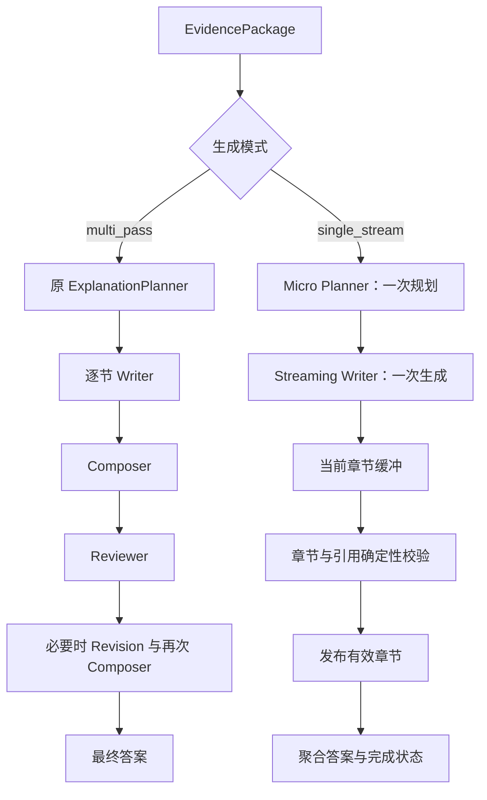

# Single-Stream Teaching 性能实验

日期：2026-10-03（Asia/Shanghai）。本轮按用户要求，每题每种模式仅一次，共四次全链路请求；没有预热、额外重跑、质量 A/B、冻结证据对照或模型裁判。质量由人工阅读判断。

## 1. 结论

**实现已完成，实验结果支持继续保留显式实验开关，但不足以推广为默认模式。**

- Q1 提供了一组完整对照：总耗时从 401.89 秒降至 111.35 秒，下降 **72.3%**；教学生成阶段下降 **75.0%**。全链路 LLM 调用从 17 次降至 5 次，候选 Writer 仅调用一次，11 个章节全部通过校验。
- Q3 候选在 101.10 秒结束，只发布 5/10 个完整章节，结果为 `partial`；旧模式的后续对照收到 HTTP 402 余额不足，最终只有 26 字的无证据提示。两者都不能构成完整回答性能对照。
- 四次请求已全部尝试完成，未自动重跑。此次整体实验不能判为通过；Q1 达到单次观察目标，Q3 无有效对照且候选不完整。
- 默认继续 `multi_pass`。没有执行质量评分，不对“质量接近旧版”作结论。

## 2. 版本、配置与链路

基线是当前 `main` 的 `63c6380`，实际采样使用 `2ddb45a0fa69656a188af33fa59a3c065e69f1c7`，由模式开关选择保留的旧流程或新流程。分支为 `codex/single-stream-teaching`。

文档中的历史 Q1/Q3 基线包含章节并发优化，而本轮当前代码逐节串行生成。历史文件没有参与本轮性能计算。

模型保持 `deepseek-flash`，教学 Planner/Writer reasoning effort 均为 `high`；嵌入模型 `text-embedding-v4`、1024 维；`teach`、`detailed`、top-k 12。模型窗口 131072，模型输出能力上限 32768；实验 detailed Writer 总预算为 11000 token，含模型 reasoning 输出预算，正文软目标 3000～5000 中文字符。该预算不随 micro 节数增长。

索引为 538 个 CODE chunk、2574 个 DOCUMENT chunk。采样前后指纹一致：`index_unchanged=true`。完整安全配置快照见 [manifest.json](../../artifacts/single-stream-experiment/manifest.json)，其中没有 API key 或数据库凭据。



新路径不会自动调用旧流程，也不会在发布后重播。CLI 暂时一次性显示聚合答案；章节回调与 TTFS 表示调用方已经能获取首个有效章节，不代表页面已经逐节渲染。

## 3. 四次原始性能结果

执行顺序：Q1 multi_pass → Q1 single_stream → Q3 single_stream → Q3 multi_pass。

Q1：详细解释当前购票占座的数据一致性是如何保证的。

Q3：详细解释当前订单和支付链路是如何保证幂等的。

| 样本 | 全链路秒 | 教学生成秒 | LLM 全部 / 生成 | TTFT 秒 | TTFS 秒 | 答案字符数 | 状态 |
|---|---:|---:|---:|---:|---:|---:|---|
| q1-multi_pass | 401.89 | 356.81 | 17 / 14 | — | — | 20092 | 完成；Composer 回退拼接 |
| q1-single_stream | 111.35 | 89.11 | 5 / 2 | 102.37 | 103.42 | 3217 | complete，11/11 |
| q3-single_stream | 101.10 | 47.28 | 7 / 2 | 87.32 | 88.88 | 2998 | partial，5/10 |
| q3-multi_pass | 52.94 | 1.12 | 7 / 2 | — | — | 26 | 失败；HTTP 402 |

“教学生成”包括 Explanation/Micro Planning、Draft、Review、Revision；Composer 耗时已经包含在 Draft 或 Revision 阶段，不重复相加。“生成调用数”按真实 call trace 计数，包含 Planner、Writer、Composer、Review/Revision。TTFT/TTFS 以工作流请求入口为原点，总耗时还包含调用方初始化的少量开销。

Q1 候选 Writer 开始时间为 49.84 秒，首正文相对 Writer 开始需 52.52 秒，首有效章节需 53.57 秒。TTFS 比最终请求完成提前 **7.93 秒**。Provider 上报 Writer reasoning 7791 token、可见输出 1864 token；首正文等待与较多 reasoning 输出同时出现，尚不能据单次样本判定稳定瓶颈。

Q3 候选 Writer 首正文相对开始需 4.79 秒，首有效章节需 6.34 秒；尽管提前发布章节，最终状态仍是不完整。

### Token 使用

| 样本 | 已上报输入 token 合计 | 已上报输出 token 合计 | 全链路 reasoning token |
|---|---:|---:|---:|
| q1-multi_pass | 66385 | 68153 | 未知（部分调用未上报） |
| q1-single_stream | 30558 | 19921 | 14667 |
| q3-single_stream | 36277 | 21644 | 14514 |
| q3-multi_pass | 17724 | 10970 | 未知（部分调用未上报） |

Provider 的 completion token 包括 reasoning。旧模式失败调用没有完整用量，以上输入/输出合计是已上报部分，不是缺失调用的估算。reasoning 不完整时标为未知；没有将字符估计混入真实 token。逐次 Writer 使用量见性能 JSON 的 `stream.attempts`。

### 完整答案与原始文件

| 样本 | 人工阅读 | 性能 JSON | 完整日志 |
|---|---|---|---|
| Q1 multi_pass | [答案](../../artifacts/single-stream-experiment/q1-multi_pass.answer.md) | [性能](../../artifacts/single-stream-experiment/q1-multi_pass.json) | [日志](../../artifacts/single-stream-experiment/q1-multi_pass.out) |
| Q1 single_stream | [答案](../../artifacts/single-stream-experiment/q1-single_stream.answer.md) | [性能](../../artifacts/single-stream-experiment/q1-single_stream.json) | [日志](../../artifacts/single-stream-experiment/q1-single_stream.out) |
| Q3 single_stream | [不完整答案](../../artifacts/single-stream-experiment/q3-single_stream.answer.md) | [性能](../../artifacts/single-stream-experiment/q3-single_stream.json) | [日志](../../artifacts/single-stream-experiment/q3-single_stream.out) |
| Q3 multi_pass | [失败提示](../../artifacts/single-stream-experiment/q3-multi_pass.answer.md) | [性能](../../artifacts/single-stream-experiment/q3-multi_pass.json) | [日志](../../artifacts/single-stream-experiment/q3-multi_pass.out) |

原始产物在初次实验提交时保留于 git 忽略的 artifacts 目录；后续按用户要求，答案、性能、配置与运行日志已显式纳入版本控制，并从原始日志提取独立 trace，方便远程分析。阅读入口见 [真实回答分析样本](../../artifacts/README.md)。[summary.json](../../artifacts/single-stream-experiment/summary.json) 提供精简机器可读结果。

## 4. 引用检查、失败样本与观察限制

Q1 候选已规划、闭合、校验发布 11 节，失败 0 节、重试 0 次；Q3 候选已规划 10 节，闭合并发布 5 节，缺失 S6～S10，失败位置 S6，重试 0 次。两份候选已发布正文的无效引用均为 0，不含内部 marker 或 reasoning 文本。

引用校验只保证标签真实存在并属于本节实际输入证据的 allowlist，不能替代对事实和因果解释的人工阅读。

失败情况：

1. **Q1 旧模式 Composer 输出达到上限。** `finish_reason=length`，该调用耗时 60.53 秒，既有逻辑回退为确定性章节拼接，之后继续 Review。答案约 20092 字符，候选仅 3217 字符。性能变化同时受到调用链减少、规划简化、输出收敛与这次 Composer 失败影响，不能全部归因于传输改为流式。
2. **Q3 候选未覆盖完整计划。** Provider 以 `finish_reason=stop` 正常结束，但只得到 5/10 个完整章节；Parser 在最终检查报 `missing or unclosed section`，保留前五节并标为 `partial`。不是 token 上限错误，也没有在发布后重试或重新播放。后续应改善模型对完整计划和每节长度分配的遵守程度；本轮没有追加真实调用验证修改。
3. **Q3 旧模式账户余额不足。** Explanation Planner 和首个 Section Writer 均收到 HTTP 402 `Insufficient Balance`。旧模式按既有逻辑返回无证据提示，CLI exit code 仍为 0；因此进程正常退出不能等同于答案成功。52.94 秒不是完成回答的性能。

两种模式独立执行检索，EvidencePackage 并不完全相同。没有冻结证据对照，也没有重复采样；不计算统计置信区间或稳定性能提升。

| 观察目标 | Q1 | Q3 |
|---|---|---|
| 完整候选答案 | 达到，11/11 | 未达到，5/10 |
| 单次全链路耗时下降至少 30% | 达到，72.3% | 无有效旧模式对照，不能计算 |
| 正常候选 Writer 一次调用 | 1 次 | 1 次，但结果 partial |
| 首有效章节早于结束 | 达到 | 提前发布，但最终不完整 |
| 发布正文非法引用为零 | 达到 | 已发布五节达到 |
| 质量接近旧版 | 待用户主观阅读 | 不完整，不作判断 |

## 5. 验证、接口与使用

实施前测试为 472 passed、1 skipped；之后单独启用 PostgreSQL 集成测试并通过。最终完整检查启用集成测试后 **531 passed**，全部使用固定数据或本地假 SSE 服务，不增加真实 LLM 调用。

覆盖模式默认值与 CLI 优先级、各深度预算、章节拆包及 UTF-8 拆字节、引用 allowlist、乱序/缺节/空节、reasoning 隔离、发布前重试、发布后不重播、HTTP 错误/超时/资源释放、缺失 usage、重试成本以及性能统计不重复计时。

新增接口：`TeachingRuntimeOptions`、`MicroSectionPlan`/`MicroSection`、独立 `StreamingLLMClient.generate_stream()`、`StreamEvent`、`ValidatedSection` 和 `TeachingExplanationWorkflow.run(..., on_section=...)`。旧 `generate()` 与 `AnswerResult` 结构保留；`TeachingAnswerResult` 增加完成状态、失败章节和错误信息的默认字段。

```powershell
uv run devcontext ask "详细解释当前购票占座的数据一致性是如何保证的" --answer-mode teach --depth detailed --teaching-generation-mode single_stream --perf --perf-json artifacts/single-stream.json
```

配置优先级：CLI > `TEACHING_GENERATION_MODE` > 默认 `multi_pass`。回退只需切回 `multi_pass`，无数据迁移。

四次采样期间没有变更运行代码或配置。采样后修正了三个诊断边界：Micro Plan 序列化使用列表使 planned-section 统计正常；重试中缺失 usage 时不将部分合计当作完整合计；空响应的 HTTP 401/402 也判为不可重试。这些修正均由本地测试验证，没有再次执行真实采样。原始 JSON 保留采样时的字段值：候选 summary 的 `planned_section_count=null`，应读取 `stream.sections_planned`；报告没有修改原始结果。

Provider SSE、结束信号和用量处理依据 [DeepSeek Chat Completions 官方文档](https://api-docs.deepseek.com/api/create-chat-completion/)。

## 6. 后续建议

保留显式实验开关，不升级默认值。先处理 Q3 完整计划未被遵守的问题，再由用户主观阅读 Q1 两份完整答案决定长度收敛是否合适。只有在用户另行授权补测后，才补充余额恢复后的 Q3 对照；此次没有发起更多请求，也没有自动启用 Router、resume、取消或页面逐节呈现。
