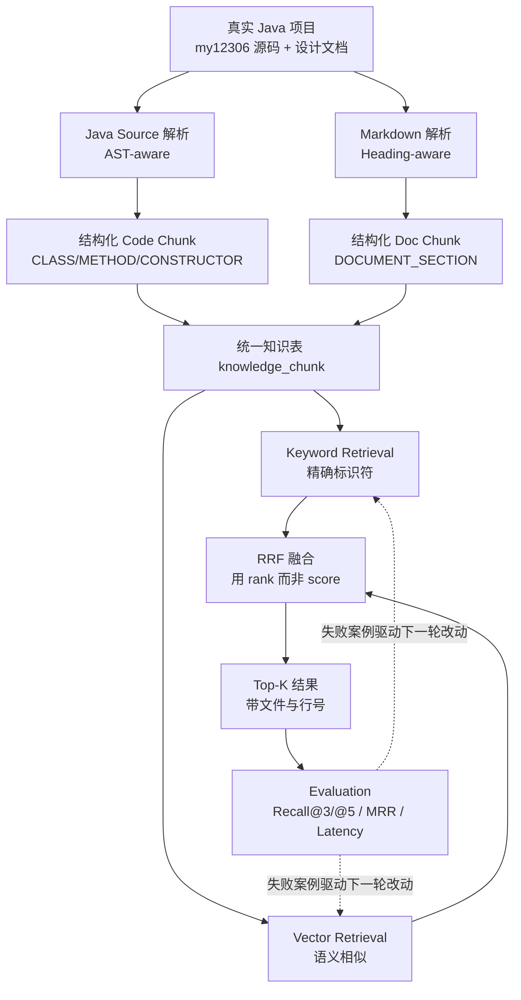

# DevContext-Java 项目初始搭建详细解读

> 面向读者：本项目作者本人（已熟悉 Java 后端，了解基础 RAG / Embedding / Chunk / 向量检索，刚开始学习 Agent 与 Context Engineering）
> 解读对象：当前仓库 `DevContext-Java` 的**实际实现**
> 解读版本：截至 2026-09-22 的仓库状态（无 Git 提交历史，`git log` 为空）
> 本文不修改任何业务代码，只做解读

---

## 0. 阅读说明：本文的证据规则

这份文档要回答的不是"有哪些文件、每个文件做了什么"，而是"为什么会长成现在这样"。因此每一处结论都标注证据等级，避免把规划当成事实、把推断当成实测。

| 标记 | 含义 | 来源 |
|---|---|---|
| 【实测】 | 从运行产物、评测报告、验证报告中直接读到的事实 | `README.md`、`docs/verification.md`、`artifacts/*.json`、`artifacts/java-chunks.jsonl` |
| 【代码可证】 | 直接从当前源码/DDL/配置读出的行为 | `src/`、`sql/001_schema.sql`、`java-parser/src/`、`docker-compose.yml` |
| 【文档依据】 | 来自规划/架构决策文档的设计意图 | `docs/`、`docs/development/`、`docs/项目规划文档/` |
| 【推断】 | 由前几类证据推导，但源码未直接证明 | 文中显式写出"推断" |
| 【无法确认】 | 仓库内没有足够证据，不猜测 | 显式写"当前无法确认" |

本文中所有数字都可在上述文件中复核。凡是规划文档写了、但当前代码里找不到对应实现的，本文一律写成"规划要求，当前未实现"，不会写成已完成。

---

## 1. 项目到底解决什么问题

### 1.1 先看那条"标准 RAG 流水线"为什么不够

几乎所有 RAG 入门教程给出的都是这条链路：

```text
Repository → Chunk → Embedding → Vector Search → LLM
```

这条链路在"PDF 问答"上能跑通，但把 `Repository` 换成一个真实 Java 项目时，会在四个地方同时失效。

**第一处失效：Chunk 这一步把语义结构切碎了。**
按固定 512/1024 token 切一个 Java 文件，会得到这种片段：

```java
    if (result) {
            return PurchaseReservationResult.success(orderSn);
```

它可能切在方法中间，可能把 `@Transactional` 和它注解的方法切开，也可能把两个不同方法的半截拼在一起。这样的片段即使向量化了，也既回答不了"这个方法做什么"，也定位不到"这个方法在哪"。而 RAG 的效果上限，在 Chunk 这一步基本就定死了——后面 Embedding 模型再强、Reranker 再好，都只能补救，不能还原已经被切碎的结构。

**第二处失效：纯向量检索对"精确符号"没有优势。**
Java 项目里最自然的一类问题，形式是这样的：

```text
PurchaseTicketTxService.doPurchaseInTransaction 的事务购票实现在哪里？
```

用户要的不是"意思相近的代码"，而是"**真的包含这个字符串的那段代码**"。向量检索把整句做 embedding 去比余弦相似度。`doPurchaseInTransaction` 这个标识符在整句里的语义贡献被稀释，而 `purchaseTickets`、`PurchaseTicketServiceImpl`、`loadTrain` 这些"长得像但不正确"的方法，余弦相似度可能都在 0.79～0.81 的窄区间里——分不出来。当前评测数据里这一点被直接证实：CODE-001（找 `doPurchaseInTransaction`）在**向量检索下 Recall@3 = 0.00**，在关键词检索下 Recall@3 = 1.00。

**第三处失效：只有代码语料，回答不了"为什么"。**
`my12306` 项目里同一个技术问题往往有两条线索：

```text
“为什么要把 Feign 调用移出购票事务？”
   → 答案在 Markdown 设计文档里（Design Decision）
   → 证据在 Markdown 实验报告里（P99 / SQL 数量变化）
   → 落点在某个 Java 方法里（Implementation）
```

只索引 Java 源码，只能回答"改在哪"；只索引 Markdown，只能回答"为什么这么想"。而项目规划里把"为什么这样设计，并且如何实现"这一类（MIXED）定义成**最重要的应用场景**（`docs/项目规划文档/devContex-项目背景和约束.md` §4、§22 中 MIXED 配额最高）。

**第四处失效：单路检索的排序不可信。**
关键词检索的分数空间和向量检索完全不同。当前实现里这一点可见得很直白【实测】：

| 策略 | 单条结果的 score 量级（同一批评测里） |
|---|---|
| Keyword | `28.1010`（`PurchaseTicketTxService` 类切片） |
| Vector | `0.7327`（余弦相似度） |
| Hybrid(RRF) | `0.0272` |

`28.1 > 0.73` 不代表前者更相关，它们不是同一个评分体系。这意味着"把两路结果拼起来直接排序"这种做法在数学上就是错的。

### 1.2 因此 DevContext 同时处理六件事

上面四处失效，直接决定了项目必须同时处理六件事，它们不是"功能堆叠"，而是"四个失效点各自的解法"：



- **处理 Java Source**：为了不切碎语义结构（解决失效一）；
- **处理 Markdown Documentation**：为了让"为什么"这一半问题有语料（解决失效三）；
- **Keyword Retrieval**：为了让精确标识符可命中（解决失效二）；
- **Vector Retrieval**：为了让自然语言的"意思"也能命中；
- **Hybrid Retrieval**：为了把两路合起来且**不比较不可比的分数**（解决失效四）；
- **Evaluation**：为了知道上面五项到底有没有做对（否则一切都是主观感受）。

一个关键设计选择是：**Keyword 与 Vector 是并列的两条腿，不是"主路 + 兜底"。** 评测结果里两者各有独占胜利：CODE-001 只有 Keyword 能排到第 1；DOC-001 只有 Vector 能把 `P2——支付与超时取消功能详细分析文档` 排到第 1。任何一条腿拿掉，都会有题目直接掉出 Top-3。

### 1.3 它与"PDF RAG Demo"的区别

| 维度 | 普通 PDF RAG Demo | DevContext-Java |
|---|---|---|
| 语料 | 一堆互不相关的文档 | 一个有真实结构的 Java 多模块工程 + 与之配套的设计/实验文档 |
| Chunk 依据 | 固定字符数 / token 数 | Java：AST 节点边界；Markdown：标题层级 |
| 每个 Chunk 带什么 | 通常只有 `text` + `source` | 内容 + module/package/class/symbol/signature/annotations/javadoc/heading_path/精确 start-end 行号 |
| 检索 | 只有向量 | 关键词（字段加权）与向量**并列**，再用 RRF 融合 |
| 分数可比性 | 单路，无此问题 | 必须处理"两个不同评分空间"的问题，因此不能加权求和 |
| 定位能力 | 到"第几页/第几段" | 到 `file_path:start_line-end_line`，内容与原始源码逐字一致 |
| 评测 | 通常没有，或只看"答案像不像" | 12 条带 Ground Truth 的题目，检索质量脱离 LLM 单独度量 |
| 是否生成答案 | 是（LLM 直接答） | **当前版本刻意不生成答案**（详见第 12 章） |

最后一行值得强调：当前版本**不是**一个"问它它就回答"的系统，而是一个**可量化的检索内核**。它的产出是"给定问题，正确的代码/文档片段能不能被找到、排在第几"。原因在第 10 章展开：把"检索质量"和"生成质量"混在一起评测，失败时无法归因。

---

## 2. 完整数据流

### 2.1 总览

从真实 `my12306` 仓库出发，当前实现的完整链路如下【代码可证】：

```text
Repository (双根)
   │
   ├─ ① Scan      扫描两个根，按规则过滤
   ├─ ② Parse     Java → JavaParser AST ／ Markdown → 标题树
   ├─ ③ Chunk     按语法/标题边界切成 Chunk
   ├─ ④ Metadata  为每个 Chunk 补齐结构化字段 + content_hash
   ├─ ⑤ Embedding 组 embedding_text → 百炼 text-embedding-v4 → 1024 维
   ├─ ⑥ Store     单事务内 DELETE + INSERT，写入 PostgreSQL/pgvector
   │
   ├─ ⑦ Keyword Retrieval   标识符抽取 + 字段加权 + pg_trgm
   ├─ ⑧ Vector Retrieval    query embedding + 精确 cosine
   ├─ ⑨ RRF                 两路各取 20，按 rank 融合，输出 Top-K
   └─ ⑩ Evaluation          12 题 × 3 策略 → Recall@3/@5、MRR、Latency
```

真实规模【实测】（`docs/verification.md` + `artifacts/java-chunks.jsonl` 复核）：

| 项 | 数值 |
|---|---|
| Java 文件扫描/解析成功/失败 | 218 / 218 / 0 |
| 代码切片 | 538（METHOD 316、CLASS 165、INTERFACE 38、CONSTRUCTOR 19） |
| 代码切片的 `file_path` 去重数 | 206 |
| 文档文件 | 57 |
| 文档切片 | 2363 |
| 总切片 | 2901 |
| 第三方文档（`bower_components` / `sbadmin2-*`）入库数 | 0 |

下面逐步拆解。

---

### 步骤 ① Scan：确定"从哪里读"

**输入**：两个根目录。`DEVCONTEXT_CODE_ROOT`（`my12306` 源码）与 `DEVCONTEXT_DOC_ROOT`（`docs`）【代码可证】（`src/devcontext/config.py`）。
**输出**：两批待处理文件。
**为什么需要这一层**：因为实测发现代码和文档**根本不在同一个根下**：

```text
D:\Java-learning\12306Project\
├── 12306\my12306\   ← 只有 .java，没有 .md
└── docs\            ← 只有 .md
```

规划文档原本假设"一个 Java Repository 同时包含 Java 与 Markdown"，实测不成立【文档依据】（`docs/development/00-p0-scope.md` §6.2）。这个发现触发了一条新的架构决策（ADR-012 双根目录模型），否则 MIXED 类问题将完全没有文档语料。

**扫描过滤规则不同，且必须是两套**【代码可证】：

- Java 侧（`Main.findJavaFiles`）：只收 `.java`，且路径必须包含 `/src/main/java/`，再排除 `target/`、`.git/`、`.idea/`。
  这条 `/src/main/java/` 过滤解释了 236 → 218 的差额（推断：`src/test/java` 下的文件被排除）。
- Markdown 侧（`iter_markdown_files` + `_is_excluded`）：收 `*.md`，排除路径中任意一段是 `bower_components` / `node_modules` / `target` / `.git` / `.idea`，或目录名以 `sbadmin2-` 开头。

注意这里有一个**风险与设计并存**的细节：规划文档建议"按路径前缀排除第三方目录"（`docs/development/01-architecture-decisions.md` Risk 03），而当前实现是按**目录名/前缀**排除。对当前语料它有效（验证报告显示第三方文档入库数 = 0）【实测】，但换一个语料时是否仍有效，**当前无法确认**。

**与下一层的关系**：Scan 只决定"读哪些文件"，不做任何内容理解。它的输出直接喂给 Parser。

---

### 步骤 ② Parse：两种语料、两种解析器

**输入**：文件列表。
**输出**：Java → AST（`CompilationUnit`）；Markdown → 章节列表（`_Section`）。
**为什么需要这一层**：因为"边界"这个概念在两种语料里含义完全不同。Java 的边界由语法定义（哪个大括号配哪个），Markdown 的边界由标题层级定义。想用一套规则处理两者，必然有一边是错的。

实现上是**两个完全独立的进程**：

```text
java-parser/  (独立 Maven CLI, Java 21 + JavaParser 3.28.2)
      ↑ subprocess
src/devcontext/ingestion/java_parser_runner.py
```

Python 侧不解析 Java，只负责 `mvn package` → `java -jar` → 读 JSONL【代码可证】（`java_parser_runner.py`）。这个设计有两个直接好处：

1. Java 解析逻辑可以脱离整套 Python 环境单独运行与测试（Java 侧有独立 JUnit 测试）；
2. 两边的失败互不污染——Java 解析崩了不会拖垮 Python 进程，反之亦然。

**与上一层的关系**：Scan 决定输入集合，Parse 对该集合逐文件处理。
**与下一层的关系**：Parse 的结果不直接入库，而是先被 Chunk 成"最小可独立理解的语义单元"。

---

### 步骤 ③ Chunk：决定"什么是一份知识"

**输入**：AST / 章节树。
**输出**：Chunk 列表。
**为什么需要这一层**：这是整个系统里**最关键的一层**，也是普通 RAG 最容易做错的一层。Chunk 粒度决定了"系统认为什么是一份可以独立理解和检索的知识单元"。粒度选错，后面全部只能补救【文档依据】（ADR-002）。

当前实现产出五种 `chunk_type`【代码可证】（`sql/001_schema.sql` 的 CHECK 约束）：

```text
CODE : CLASS / INTERFACE / METHOD / CONSTRUCTOR
DOC  : DOCUMENT_SECTION
```

注意一个实现细节：代码里 `ClassOrInterfaceDeclaration` 按 `isInterface()` 决定输出 `INTERFACE` 还是 `CLASS`，因此有 38 个 INTERFACE + 165 个 CLASS。

**与上一层的关系**：Chunk 完全依赖 Parse 给出的语法/标题边界，不自己猜边界。
**与下一层的关系**：每个 Chunk 之后会被补齐元数据（步骤 ④），并被组装成两段不同的文本（步骤 ⑤）——**这是本系统一个容易被忽略但很重要的设计**：同一个 Chunk 会派生两段文本，一段供关键词检索，一段供向量检索。

---

### 步骤 ④ Metadata：把"位置"和"身份"变成可查询的字段

**输入**：Chunk。
**输出**：补齐 `module` / `package_name` / `class_name` / `symbol_name` / `signature` / `annotations` / `javadoc` / `title` / `heading_path` / `start_line` / `end_line` / `content_hash`。
**为什么需要这一层**：如果 Chunk 只有一段文本，那么"检索到的到底是不是我要的那个方法"这件事只能靠人读文本判断，无法程序化校验，也无法评测。元数据的存在，让评测可以写成"是否命中 `symbol_name = doPurchaseInTransaction`"，而不是"人看一下像不像"。

**与下一层的关系**：元数据不是给 Embedding 用的（下面会讲为什么），而是给**关键词检索**和**评测判分**用的。

---

### 步骤 ⑤ Embedding：把 Chunk 变成向量

**输入**：每个 Chunk 的 `embedding_text()`。
**输出**：1024 维向量。
**为什么需要这一层**：让"字面上不重合但意思相近"的 Chunk 也能被找到。文档里的"D2-设计分析-余票令牌桶与Lua.md"和用户问的"为什么使用余票令牌桶"字面重合度不高，本层负责把它们拉到一起。

**与上一层的关系**：本层只消费 Chunk 的一部分字段（详见第 6 章，`embedding_text()` 只取 identity + javadoc + content）。
**与下一层的关系**：向量写入 `embedding VECTOR(1024)` 列，供步骤 ⑧ 使用。

---

### 步骤 ⑥ Store：写入 PostgreSQL

**输入**：Chunk 列表 + 向量列表 + 模型名。
**输出**：`knowledge_chunk` 表的行。
**为什么需要这一层**：需要**同一行上同时具备**内容、元数据、关键词检索文本和向量——这样 RRF 融合时 `id` 就是两路结果天然的连接键，不需要跨存储对齐【文档依据】（ADR-005）。

写入方式是**事务化全量重建**：

```python
with connection.transaction():
    DELETE FROM knowledge_chunk WHERE repository = %s
    executemany(INSERT ...)
```

**与上一层的关系**：Embedding 全部完成后才开启事务（这一点很重要，见第 11 章）。
**与下一层的关系**：建好的索引是步骤 ⑦⑧ 的唯一数据源。

---

### 步骤 ⑦⑧ 两路 Retrieval：两条腿

**Keyword（⑦）**：输入是**原始查询字符串**；输出是带 `score` 的结果列表。它做的是"抽取标识符 → 按字段加权 → 子串/trigram 匹配"（详见第 7 章）。
**Vector（⑧）**：输入是查询 embedding；输出是按余弦相似度排序的结果列表（详见第 8 章）。

**为什么必须两路并列**：因为两类问题的"正确答案特征"不同。符号类问题（`scanTimeoutOrder`）的正确答案**必然包含那个字符串**；语义类问题（"为什么使用余票令牌桶"）的正确答案可能**一个共享词都没有**。任何单一信号都有系统性盲区。

**与下一层的关系**：两路各自给出排序，交给 RRF 融合。

---

### 步骤 ⑨ RRF：融合，但不比较分数

**输入**：两路各 20 条结果（`pool_size = max(20, top_k)`）【代码可证】（`retrieval/service.py`）。
**输出**：融合后的 Top-K（默认 10）。
**为什么需要这一层**：详见第 9 章。核心一句话：**两个榜单的分数量纲不同，不可比；但"排在第几"是可比的。**

**与下一层的关系**：融合后的 Top-K 就是评测的输入。注意当前实现中**评测调用的就是生产同一条代码路径**（`evaluation/runner.py` 直接调用 `RetrievalService.search`），不是另写一条简化路径【代码可证】。

---

### 步骤 ⑩ Evaluation：把"感觉不错"变成数字

**输入**：`benchmark/cases.jsonl` 的 12 条题目 + 三种策略的检索结果。
**输出**：`artifacts/evaluation-<时间戳>.json`。
**为什么需要这一层**：因为"检索得好不好"必须有独立于 LLM 的答案，否则每次改动都只能靠感觉判断（详见第 10 章）。

---

## 3. JavaParser 部分重点解析

### 3.1 为什么 Java 代码不能简单按固定 Token 切

先看一个反例。假设按 1000 字符切 `PurchaseTicketTxService.java`，很可能出现：

```text
Chunk A 尾部：  ... @Transactional(rollbackFor = Exception.class)
                public PurchaseReservationResult doPurchaseInTransaction(
                        PurchaseTicketReqDTO requestParam, String userId,
Chunk B 头部：  String username, String orderSn,
                        Map<String, PassengerActualRespDTO> passengersById) {
                    TrainDO trainDO = loadTrain(requestParam.getTrainId());
```

这段代码在文本上被完整保存了，但它作为一个**检索单元**已经废了：

1. 注解、方法名、签名、前半段方法体在 A 里，后半段在 B 里，两边都不完整；
2. B 的 `start_line` 指向方法体中部，用它做 Citation 会误导读者；
3. 任何"这个方法做什么"的问题，A 和 B 都答不完整，反而可能因为"各占一半相似度"而双双被召回，挤占 Top-K。

更根本的原因是：**Java 里"找方法边界"不是一个字符串问题。** 大括号可以嵌套，字符串字面量和注释里可以出现任意字符（包括 `}`），泛型和注解让"看起来像声明"的地方未必是声明。用正则或定长切分，产出的是"看起来像代码的文本块"，不是"语义单元"。

JavaParser 提供的正是这件事的确定性答案：`MethodDeclaration` 对象本身就带有 `getRange()`，也就是**语法定义的、精确的起止行列**。

### 3.2 当前的三类 Code Chunk

| chunk_type | 内容是什么 | 对应真实例子 |
|---|---|---|
| `METHOD` | **完整原始源码切片**（含注解，不含 Javadoc 注释行） | `doPurchaseInTransaction`，`PurchaseTicketTxService.java:69-172` |
| `CONSTRUCTOR` | 完整原始源码切片 | 19 个 |
| `CLASS` / `INTERFACE` | **摘要**：Javadoc + 注解 + 类声明（含 extends/implements/permits）+ 字段声明 + 构造方法签名 + 方法签名列表。**不是整类源码** | `TicketAvailabilityTokenBucket`，`TicketAvailabilityTokenBucket.java:37-214` |

真实 CLASS 摘要在系统中的样子【实测】（取自 `artifacts/java-chunks.jsonl`）：

```text
* Redis 余票令牌桶只负责购票准入，不是库存事实源。
 * 异常时始终降级放行，最终是否能占座仍由 MySQL 条件更新决定。
@Slf4j
@Component
@RequiredArgsConstructor
public class TicketAvailabilityTokenBucket {
  private static final long TAKE_SUCCESS = 1L;
  private static final DefaultRedisScript<Long> TAKE_TOKEN_SCRIPT = loadScript("lua/take_token_from_bucket.lua");
  private final StringRedisTemplate stringRedisTemplate;
  ...
  public void initializeBuckets();
  public TokenTakeResult takeToken(TokenTakeRequest request);
  ...
}
```

（注意：因为 `content` 是对源码做的 Range 切片，字段行保留了原始缩进，而方法签名行是由 `getDeclarationAsString()` 重新生成的——两者缩进不完全一致。这是当前实现的真实形态，不影响检索，但读文档时值得知道。）

**三类 Chunk 的分工**，是这个项目里最容易讲清楚的一个设计点：

```text
CLASS   = 地图    “这个类提供哪些能力、它是什么角色（@Service/@FeignClient）、它继承/实现了谁”
METHOD  = 具体地点 “某个行为到底怎么实现的”
```

为什么两者都要有？因为有一类问题是查单个方法答不出来的。例如：

> 问：为什么 Feign 调用要移出购票事务？
> 文档里说的是类名 `TicketServiceImpl` / 服务边界，而具体改动落在某个方法里。

如果没有 CLASS 级 Chunk，"类名"这条线索就断了。

**为什么 CLASS 必须是摘要而不是整类源码**：如果把一个 200+ 行的类整块作为 Chunk，会同时犯三个错【文档依据】（ADR-002）：

1. 它的 embedding 是全类语义的平均，对任何具体问题都"有点像但都不准"；
2. 它与类内每个 METHOD Chunk 内容重叠，导致同一段代码在结果里反复出现；
3. 它会挤占有限的 Top-K 与 Context 预算。

**为什么 CONSTRUCTOR 要独立成一类**：构造器没有返回类型，`getType()` 不存在，与 METHOD 的字段语义不同；而且它的名字恰好等于类名，如果混进 `symbol_name` 会让"类名匹配"这件事被污染【文档依据】（ADR-002）。当前语料里有 19 个构造器 Chunk。

### 3.3 每个字段为什么重要

以真实数据为例：`doPurchaseInTransaction` 这个 METHOD Chunk 在库里的字段是【实测】：

| 字段 | 该 Chunk 的实际值 | 为什么重要 |
|---|---|---|
| `module` | `ticket-services` | 由 `detectModule` 从路径中 `src` 的**前一段**推出。多模块工程里这是最自然的一级划分；但注意**它当前不参与检索**（见第 7、12 章） |
| `package_name` | `edu.swu.fcj.my12306.biz.ticketservice.service.impl` | 表明这是实现类而非接口；**当前也不参与检索** |
| `class_name` | `PurchaseTicketTxService` | 关键词检索的加权字段之一；也让同一个类下的多个方法可被一起定位 |
| `symbol_name` | `doPurchaseInTransaction` | **关键词检索最高权重字段**。它是"精确符号命中"的判据，也是评测判分的依据（`benchmark` 里 CODE 题的 Ground Truth 就是 `symbol`） |
| `signature` | `public PurchaseReservationResult doPurchaseInTransaction(PurchaseTicketReqDTO requestParam, String userId, String username, String orderSn, Map<String, PassengerActualRespDTO> passengersById)` | 完整签名让"参数形态"也能被检索到；也是 `getDeclarationAsString()` 重新格式化的结果（与 content 的原始文本不同） |
| `annotations` | `["@Transactional(rollbackFor = Exception.class)"]` | 注解常是问题的真正关键词（`@Transactional` / `@Bean` / `@FeignClient`）。**注意：它当前不直接进入 keyword_text**——但因为它落在 METHOD 的 Range 内，实际会出现在 `content` 里而被搜到 |
| `javadoc` | `* 在锁内原子完成选座、条件占座和车票写入；必须由外层 Bean 调用以经过 Spring 事务代理。` | 中文 Javadoc 是**语义检索的重要入口**：它是自然语言，和用户的中文问题天然更接近。这是本 Chunk 能同时被向量和关键词命中的关键 |
| `file_path` | `services/ticket-services/src/main/java/edu/swu/fcj/my12306/biz/ticketservice/service/impl/PurchaseTicketTxService.java` | 相对各自根目录记录（双根），保证不泄漏本机绝对路径；它是 Citation 的主体 |
| `start_line` / `end_line` | `69` / `172` | Citation 与"内容自洽性"的基础。评测与人工复核都靠它 |
| `content` | 从源码第 69 行到第 172 行的**逐字切片** | 用户最终要读的东西；也是关键词 `content` 项与 embedding 的原料 |

### 3.4 为什么 Range + 原始源码切片优于 `Node.toString()`

这是 Java 解析部分最应该记住的一个决定【文档依据】（ADR-003）。

JavaParser 的 `Node.toString()` 走的是 `PrettyPrintVisitor`：它会**重新格式化**代码——重排缩进、可能调整空行、重排行内注释位置。语义没变，但**文本变了**。后果是连锁的：

```text
content ≠ 源文件[start_line, end_line] 的真实文本
        ↓
Citation 里的行号范围，用户照着去源文件里找，找到的东西不完全一样
        ↓
“检索到的 Chunk 是否命中 Ground Truth” 这件事无法用行号核验
        ↓
评测失去可验证性，整个 Evaluation 层的地基动摇
```

当前实现走的是另外一条路：把 `Range` 转成源码字符偏移，再对**原始 source 字符串**做 `substring`【代码可证】（`JavaSourceParser.slice` / `offset`）：

```java
int start = offset(source, range.begin);
int end   = Math.min(source.length(), offset(source, range.end) + 1);
return source.substring(start, end);
```

这条路径的收益很直接：**`content` 与 `[start_line, end_line]` 天然自洽**，不需要额外校验。真实数据证实了这一点：`doPurchaseInTransaction` 的 `content` 第一行就是 `@Transactional(rollbackFor = Exception.class)`，而 `start_line = 69`——注解确实在方法 Range 的起点，且切片保留了原始缩进与换行。

三个容易踩坑的细节，当前实现都处理了：

1. **CRLF 兼容**。`offset()` 手写逐字符扫描，遇到 `\r\n` 会一次性吃掉两个字符再计一行。这就是为什么 Java 侧的测试用例专门构造了 `\r\n` 源码并断言 `content` 里仍包含 `\r\n`【代码可证】（`JavaSourceParserTest`）。Windows 环境下的这个细节，用 `split("\n")` 的朴素写法会错位。
2. **闭区间语义**。`Range` 是闭区间（`end` 那一列也算内容），所以 `offset(range.end) + 1`；`Position` 是 1-based，所以列要 `- 1`。
3. **`storeTokens` 不能关**。`Range` 来自 tokenRange，一旦调用 `setStoreTokens(false)`，所有 `getRange()` 都会返回空。当前配置显式设了 `JAVA_21` 与 UTF-8，没有关掉它。

**没有选的两个替代方案，以及为什么**：

- `LexicalPreservingPrinter`：它保留原始词法，但它是为"改 AST 后只重排那一处、其余原样保留"这种**写场景**设计的。DevContext 是只读检索系统，用它属于超前设计。
- 直接序列化 AST 为 JSON：它输出的是节点树，而 DevContext 需要的是**扁平 Chunk 列表**，结构不匹配，只是把"抽字段"推迟。

### 3.5 单文件错误隔离

这是"能跑通 Demo"和"能跑真实仓库"的分水岭。真实仓库里总有解析不了的文件（语法版本不匹配、编码问题、生成代码）。

当前实现的做法是在**最外层循环里 try/catch**，粒度是"一个文件"【代码可证】（`Main.main`）：

```java
for (Path file : files) {
    try {
        records = parser.parse(root, file, repository);
        ... 写入 JSONL ...
        parsed++;
    } catch (Exception exception) {
        failed++;
        System.err.printf("PARSE_ERROR file=%s message=%s%n", root.relativize(file), exception.getMessage());
    }
}
```

三个设计要点：

1. **失败不影响其他文件**：一个文件抛异常，`parsed` 不加、`failed` 加一，循环继续；
2. **失败被记录而不是被吞掉**：`PARSE_ERROR file=... message=...` 打到 stderr，可追溯；
3. **有一条兜底红线**：`if (!files.isEmpty() && parsed == 0) throw`——如果**全部**文件都解析失败，说明是环境/配置级故障（例如 Java 版本不对、jar 没打出来），此时必须让整条链路失败，不能"静默产出空索引"。

第 3 点很容易被忽略，但它是**防止"看起来成功其实什么都没索引"**的关键。当前语料的结果是 `scanned=218 parsed=218 failed=0`【实测】，所以这条红线没有被触发过，但它必须存在。

Python 侧还有第二层防护【代码可证】（`java_parser_runner.py`）：读取 JSONL 时按行 `json.loads`，失败会抛 `ValueError("Invalid Java parser output at line N")`。这样 Java 侧改坏了输出格式，Python 侧会立刻报错，而不是安静地少收几个 Chunk。

### 3.6 Java 21

Maven 侧 `maven.compiler.release = 21`，`ParserConfiguration` 显式设置 `LanguageLevel.JAVA_21`【代码可证】。理由是 `my12306` 本身是 Java 21 工程（根 pom 的 `java.version`）。

这件事**不是可选项**：如果解析器按更低的语言级别解析，遇到 21 才有的语法（如 record pattern、sealed hierarchy 相关写法）会直接产生 parse problem，而当前实现对"有 parse problem"的处理是**抛异常**（`if (!result.isSuccessful()) throw`），该文件会被计为 failed。换句话说，语言级别配对的正确性，直接决定失败率。

### 3.7 为什么当前没有使用 SymbolSolver / Call Graph

一句话区分两者的能力边界：

```text
AST         回答“代码长什么样”    —— 有个方法调用叫 purchaseTicket()
SymbolSolver 回答“这个名字指向哪个声明” —— 它到底绑到哪个实现
```

当前只引入了 `javaparser-core`，**没有**引入 `javaparser-symbol-solver-core`【代码可证】（`java-parser/pom.xml` 只有 javaparser-core + jackson + junit）。四个理由【文档依据】（ADR-009）：

1. **前置配置成本高**。SymbolSolver 必须配 TypeSolver（JDK 反射、项目源码目录、依赖 jar、classloader）。`my12306` 是 5 个 Maven 模块的工程，要正确解析跨模块引用，得把所有模块源码路径和依赖 jar 都喂进去。
2. **会破坏"零依赖打包"**。`javaparser-core` 自身零运行时依赖；而 symbol-solver 会带进 javassist / guava / checker-qual。
3. **增加错误面**。解析不到符号会抛 `UnsolvedSymbolException`；在真实仓库里必然要大量 try/catch 兜底。
4. **当前阶段不需要它**。要证明的命题是"结构感知的 Chunk 比朴素文本 Chunk 更适合代码检索"——这件事只用 AST 就能验证。规划的演进路径也是 `AST Chunk → Symbol Resolution → Reference → Call Graph`。

Call Graph 属于更远的一层（要知道"谁调用了这个方法"），它依赖 Symbol Resolution 先做对，因此当前完全不涉及。

---
## 4. Markdown Chunking

### 4.1 为什么不给所有文档统一 512 Token

Markdown 的自然语义单元是**章节**，不是字符数。这一点在调研 RAGFlow 时得到了一个很硬的证据：它用 14 个不同的 chunker 应对不同文档类型，因为"问答对、表格行、幻灯片、法律条款"的语义完整单元根本不是一回事。它看起来有一个 `chunk_token_size = 512`，但那只是 General 类型分支的默认值，不是全局方案【文档依据】（ADR-004）。

统一 512 token 会带来两种错误，都很致命：

```text
太短的章节被合并 → 两个不同主题粘在一个 Chunk 里，embedding 变成混合语义
太长的章节被腰斩 → 一个完整论证被切成两半，两半都不足以回答问题
```

而且这两种错误都会**丢掉标题**——一个 Chunk 若只有正文没有标题，它连"这段在讲什么主题"都不完整，尤其当正文是表格或代码块时。

### 4.2 Heading-aware Chunking 的实际形态

当前实现【代码可证】（`ingestion/markdown_parser.py`）：

```text
逐行扫描
  ├─ 遇到 # / ## / ###…（1~6 级）→ 结束当前章节，开始新章节
  └─ 其他行 → 累积到当前章节
每个章节 → 一个（或几个）DOCUMENT_SECTION Chunk
```

三个关键行为，用真实运行结果验证过【实测】（我用当前代码对本仓库 `docs/development/01-architecture-decisions.md` 跑了一次）：

| 行为 | 证据 |
|---|---|
| `heading_path` 保存完整层级 | `['DevContext-Java 架构决策记录（ADR）', '0. 阅读约定', '0.1 状态取值']` |
| **标题行本身不属于 content** | Chunk `title = "0.1 状态取值"`，`content` 是该标题**下一行**开始的正文；`start_line` 也从标题的下一行起算 |
| 文档开头、第一个标题之前的正文被保留 | 该段落 `title` 回退为文件名（`path.stem`）；单测里断言过 `chunks[0].title == "design"` |

第 2 条值得展开：`current_first_line = index + 1`【代码可证】。这意味着 Markdown Chunk 的 `content` 里**看不到标题文字**。标题只存在于 `title` 与 `heading_path` 字段中。这个设计本身是自洽的（避免标题重复），但它带来一个后果，见 4.4 节。

### 4.3 标题层级的价值，以及 6000 字符上限解决什么

**标题层级的价值有三层**：

1. **给 Chunk 一个可读的身份**。检索结果里显示"`模块2-核心链路深挖.md` → `取舍 2：为什么'展示余票'和'令牌余量'必须是两个 Key`"，比显示一段无头正文有用得多（这正是当前评测报告里 top_results 的样子）。
2. **让同一主题的多个片段可被归一识别**。评测里 Ground Truth 用 `path_contains` / `title_contains` 判定，靠的就是这些字段。
3. **让"父级标题"成为可检索的上下文**。`heading_path` 会被拼进 `keyword_text`（`" / ".join(heading_path)`），因此检索"令牌桶"时，路径里含"余票令牌桶与Lua"的章节也能被匹配到。

**6000 字符上限解决的是另一类问题**：章节长度不受控。真实文档里存在单章节几千字、甚至含巨型表格/代码块的情况。一个 3 万字的章节如果整块作为 Chunk：

- embedding 会被截断（模型的输入长度有限），后半段等于没被索引；
- 一个 Chunk 占据大量 Top-K 位数，其他章节被挤掉。

所以设 6000 字符上限，本质是"在最坏情况下保证一个 Chunk 仍能被完整 embedding，且不至于独占结果列表"。

### 4.4 超限之后为什么"先段落、再行"

这是当前实现里比较细致的一段逻辑【代码可证】（`_split_section`）：

```text
章节 ≤ 6000 字符           → 一个 Chunk
章节 > 6000：
  ├─ 先按段落（空行分隔）累积，超过上限就断开
  ├─ 如果单个段落本身就 > 6000 → 再按行累积
  └─ 如果单行本身就 > 6000   → 硬切成 6000 字符的片
```

**为什么是"段落 → 行 → 硬切"这个顺序，而不是直接硬切**：因为这三层的语义破坏程度是递增的。

```text
段落切分   破坏最小  —— 段落本身就是作者划出的语义边界
行切分     破坏中等  —— 表格行 / 列表项是完整语义单元，切在行间可接受
硬切       破坏最大  —— 一行的中间被切开，内容已经不是原文的语义单元
```

只有在极端情况下（单行超 6000 字符，现实里几乎只有压缩过的 JSON 或超长表格行）才退到最后一种。而且**逐级降级**保证了一件事：任何一段原文都不会丢。这一点被单测直接验证过——把 `max_chars` 压到 10，然后把所有 Chunk 的 content 拼起来，断言原文的字符仍然都在【代码可证】（`test_splits_oversized_section_without_losing_text`）。

另外注意：超限拆分产生的多个 Chunk **共享同一个 `heading_path` 和 `title`**，行号区间互不重叠。这两点很关键——共享标题让它们仍可被识别为"同一章节的不同部分"；行号不重叠让 Citation 不会指错。

### 4.5 为什么要排除第三方 Markdown

`docs` 目录下混着约 30 个第三方前端库的 README（`sbadmin2` / `bootstrap` / `flot` / `metisMenu`，位于 `5-后续开发规划/baseline/results/*/`）。如果把它们索引进库【文档依据】（Risk 03）：

- 它们是英文的库使用说明，与项目设计完全无关；
- 会污染 DOC 检索结果，用无关片段挤占 Top-K，**直接拉低 DOC/MIXED 题的 Recall**；
- 每一次全量重建都白花 Embedding 调用。

当前实现的排除规则是 `bower_components` + `sbadmin2-*` 前缀 + 若干通用目录名【代码可证】，实测结果是第三方文档入库数 = 0【实测】。单测也覆盖了这一点：一个含 `bower_components/lib/README.md` 与 `baseline/sbadmin2-1.0.7/README.md` 的临时目录，只应产出 1 个 Chunk【代码可证】。

### 4.6 一个当前实现留下的缺口（代码可证）

`embedding_text()` 的构造是：

```python
heading  = " / ".join(self.heading_path)
identity = self.signature or self.symbol_name or self.title or heading
values   = [identity, self.javadoc, self.content]
```

对 DOCUMENT Chunk，`signature` 与 `symbol_name` 都是 `None`，`title` 一定存在，因此 **`identity` 永远取 `title`，`heading` 永远不会被用到**。

后果是：**标题层级只进入关键词检索，不进入向量检索文本**。实测样本能直接看到这一点：

```text
title        = "Decision"
heading_path = ["DevContext-Java 架构决策记录（ADR）", "ADR-001 Java 解析器选型", "Decision"]
embedding_text = "Decision\n\n采用 **JavaParser**，且**只引入 `javaparser-core`**。…"
```

`ADR-001 Java 解析器选型` 这个信息量更大的标题，没有进入 embedding。这是一个**明确的、代码可证的改进点**，列入第 13 章。

---

## 5. `knowledge_chunk` 与数据库设计

### 5.1 为什么代码和文档可以统一进入同一张知识表

这是整个存储设计里最核心的判断【文档依据】（ADR-005）。表面上看，Java 方法和 Markdown 章节长得完全不一样，混在一张表里像是"为了省事"。实际上统一表的收益是具体且可验证的：

**收益一：RRF 融合需要一个天然的连接键。**
关键词检索和向量检索各返回一批结果，要融合就必须能判断"这两条是不是同一条"。如果代码和文档分表存放，融合前得先跨表对齐。统一表之后，`id` 直接就是连接键，融合逻辑只有 22 行【代码可证】（`retrieval/hybrid.py`）。

**收益二：MIXED 类问题要求两类语料**能被同一次检索同时命中。
MIXED-001（"purchaseTickets 购票写链路为什么先经过校验和令牌桶，相关代码在哪里？"）的 Ground Truth 同时包含 1 个 CODE 命中和 1 个 DOC 命中。如果分表，就需要两次检索再手工合并，而且合并时又回到"分数不可比"的老问题。

**收益三：检索可以跨类型排序。**
现实问题不会遵守"这是代码题"或"这是文档题"的边界。统一表让一条 SQL 就能按相关性混排两类结果。

**代价也必须写清楚**：统一表意味着字段必须同时容纳两种语料，因此必然出现"一半字段对另一半语料为空"的情况（例如 Markdown 没有 `symbol_name`，Java 没有 `heading_path`）。当前实现接受这个代价，用 `CHECK` 约束保证取值合法，用 `NOT NULL DEFAULT '{}'` 让数组字段不出现 NULL。

### 5.2 字段的三种角色

真实 DDL 见 `sql/001_schema.sql`。按角色分成四组：

**A. 身份与定位字段**（回答"这是什么、在哪里"）

| 字段 | 类型 | 说明 |
|---|---|---|
| `id` | `BIGINT IDENTITY` | 主键，同时是 RRF 融合的连接键 |
| `repository` | `TEXT NOT NULL` | 所有检索都带 `WHERE repository = ...`，结构上支持多仓库（当前只用 `my12306`） |
| `source_type` | `TEXT CHECK ('CODE','DOCUMENT')` | 跨类型过滤与评测判分的基础 |
| `chunk_type` | `TEXT CHECK (...)` | 五种取值（见第 3.2、4.2 节） |
| `file_path` | `TEXT NOT NULL` | 相对各自根的路径，是 Citation 的主体 |
| `start_line` / `end_line` | `INTEGER`（可空） | Citation 与内容自洽性的基础；Markdown 也填，可空是为将来非行式来源留出空间 |

**B. 语义元数据字段**（回答"这个 Chunk 的代码/文档身份是什么"）

`module`、`package_name`、`class_name`、`symbol_name`、`signature`、`annotations TEXT[]`、`javadoc`、`title`、`heading_path TEXT[]`。

这组字段的存在意义是**把"人读文本才能判断"的事变成"程序可判断"**。`benchmark/cases.jsonl` 里的 CODE 题 Ground Truth 就是 `{"source_type":"CODE","symbol":"doPurchaseInTransaction"}`，评测判分函数直接比较 `result.symbol_name`【代码可证】（`evaluation/runner.py` 的 `_matches`）。没有这些字段，评测只能靠人看。

**C. 文本字段**（回答"检索什么、展示什么"）

| 字段 | 谁用它 |
|---|---|
| `content` | 展示给人看；同时进入 `keyword_text` 和 `embedding_text` |
| `keyword_text` | **只**被关键词检索用（物化列，非生成列） |
| `embedding VECTOR(1024)` | **只**被向量检索用 |

**D. 一致性与可追溯字段**

| 字段 | 说明 |
|---|---|
| `content_hash CHAR(64)` | `sha256(content)`。当前只保存，不做增量索引（规划允许全量重建） |
| `embedding_model TEXT` | 记录向量由哪个模型产出。这个字段很重要：**它是"这张表里的向量能不能互相比较"的判据**。将来换模型时，可以据此判断哪些行需要重算 |
| `created_at` | 构建时间 |

### 5.3 哪些字段参与关键词检索、哪些参与 Embedding

这是本章最需要记清的一张表。当前实现把"检索用文本"和"嵌入用文本"分成了两个独立的派生函数【代码可证】（`models.py`）：

```python
def keyword_text(self):
    values = [symbol_name, class_name, signature, title,
              " / ".join(heading_path), file_path, javadoc, content]

def embedding_text(self):
    heading  = " / ".join(heading_path)
    identity = signature or symbol_name or title or heading
    values   = [identity, javadoc, content]
```

| 字段 | 进 `keyword_text` | 进 `embedding_text` |
|---|---|---|
| `symbol_name` | ✅ | ✅（作为 identity 的候选） |
| `class_name` | ✅ | ❌ |
| `signature` | ✅ | ✅（identity 优先取它） |
| `title`（文档） | ✅ | ✅ |
| `heading_path` | ✅ | ⚠️ 仅当 identity 无值时才用（见 4.6，实际不会发生） |
| `file_path` | ✅ | ❌ |
| `javadoc` | ✅ | ✅ |
| `content` | ✅ | ✅ |
| `annotations` | ❌（但通过 content 间接可搜） | ❌（METHOD 的 content 含注解，故间接进入） |
| `module` / `package_name` | ❌ | ❌ |
| `start_line` / `end_line` | ❌ | ❌ |
| `content_hash` / `repository` / `id` | ❌ | ❌ |

### 5.4 为什么行号、hash 这些字段不应该污染 Embedding

这个问题问的是"为什么不能把整个 Chunk 的所有字段拼起来做 embedding"。四条理由：

1. **行号与 hash 是"身份的副产品"，不是"语义"**。`69`、`172`、`519d2ebf...` 这些数字对"这个方法做什么"这个问题没有任何信息贡献。把它们拼进 embedding 文本，只会稀释真正有语义的 token 的权重。

2. **`file_path` 会泄漏本机结构并污染语义**。真实路径是 `services/ticket-services/src/main/java/edu/swu/fcj/my12306/biz/ticketservice/service/impl/PurchaseTicketTxService.java`。里面有 `fcj`（作者署名）、`swu`（学校缩写）、层级目录名。大量 Chunk 共享 `services/.../src/main/java/edu/swu/fcj/my12306/biz/` 这段前缀，会让所有 Chunk 的向量都被这段公共前缀"拉近"，降低区分度。单测专门断言了这一点：`embedding_text()` 里必须**不包含** `file_path` 的内容，也不能包含字面量 `"repository"`【代码可证】（`test_embedding_text_excludes_metadata_noise`）。

3. **`symbol_name` / `signature` 却应该进 embedding**，这是关键区别。它们虽然也是"元数据"，但它们是**语义标识符**：`doPurchaseInTransaction` 这个名字本身就表达了"在事务内完成购票"，`takeToken` 表达了"取令牌"。对代码来说，标识符是最高密度的语义。所以 `embedding_text` 用 `signature or symbol_name` 作为开头（identity）——**给 Chunk 一段"自我声明"**，效果上相当于给 embedding 加了一条简短标题。

4. **`content_hash` 绝对不能进**。它是内容的高熵摘要，语义为零。更实际的问题是：如果它进了 embedding 文本，内容一改 hash 就变，embedding 缓存就永远不命中（见第 6.5 节），向量化成本会失控。

顺带一个设计上的不对称，值得注意：`keyword_text` 里**有** `file_path`，`embedding_text` 里**没有**。这不是矛盾——关键词检索里路径是有用的（用户可能按目录名/文件名找东西，如"`模块3-技术专题.md`"），而它污染向量空间。**同一个字段在两路里的价值可能相反**，这正是"两路要分开设计"的一个具体体现。

### 5.5 PostgreSQL + FTS + pgvector + pg_trgm 各自解决什么

先澄清一个**重要事实**：规划文档（`00-p0-scope.md` §2.2、`01-architecture-decisions.md` ADR-006）设计的关键词检索方案是 **PostgreSQL FTS（`tsvector` + GIN + `setweight` A/B/C 权重 + `ts_rank`）**。但**当前实际实现没有使用 `tsvector` / `ts_rank`**。

证据【代码可证】：`sql/001_schema.sql` 只创建了 `vector` 与 `pg_trgm` 两个扩展，表里**没有** `tsvector` 列，索引里**没有** GIN 的 tsvector 索引；`storage.keyword_search` 用的全部是 `strpos()`、`similarity()` 与 `unnest()`。全仓库搜索 `tsvector|ts_rank|to_tsquery` 只命中规划文档与调研文档，命中不到 `src/` 与 `sql/`。

所以下面这张表描述的是**实际实现**，并把规划意图并列出来，便于后续对照：

| 组件 | 当前实际承担什么 | 规划中原本的角色 |
|---|---|---|
| **PostgreSQL** | 唯一的存储与检索引擎：元数据、内容、关键词文本、向量、评测结果都在一处 | 同左（ADR-005 一致） |
| **pgvector** | `embedding VECTOR(1024)` 列 + `<=>` 余弦距离算子。当前**没有建 ANN 索引**（无 HNSW / IVFFlat），是精确全表扫描 | 同左 |
| **pg_trgm** | **当前关键词检索的主力**：`gin_trgm_ops` GIN 索引 + `similarity(keyword_text, query)` 打分 + `similarity > 0.03` 作为候选准入条件 | 规划里是 **P1 候选**（"先建立 Baseline 再优化"） |
| **FTS（tsvector/ts_rank）** | **未实现** | 规划里是 P0 的 P0，用于带 IDF 的 BM25 类打分与 `setweight` 字段加权 |

为什么会变成这样，仓库里没有留下直接证据（**当前无法确认**）。能确认的是结果：`pg_trgm` 提前上场了，而 `ts_rank` 从未出现。这个"事实与规划不一致"是我在解读时发现的最值得记录的一处偏差——因为它同时解释了两件事：

- 为什么在当前实现里，**字段加权是用 `CASE WHEN` 手写权重**（12/10/6/2）而不是 `setweight` 的四档权重；
- 为什么**纯中文查询的 Keyword 检索会退化**（见第 7.4 节）——`tsvector('simple')` 本来就不是为中文设计的，而 `pg_trgm` 至少在字符级子串匹配上对中文有效。

`pg_trgm` 的三个作用需要说清楚：

```text
1. GIN 索引（gin_trgm_ops）  → 让 similarity / LIKE 类查询不必全表扫描
2. similarity(a, b)          → 给出 0~1 的相似度，可排序（这是 LIKE 做不到的）
3. 阈值 0.03 作为候选准入     → 决定“哪些行进入候选池”
```

第 3 点目前偏低（0.03），意味着**候选池很宽**。这在第 9 章分析 Hybrid 的排序损失时，是一个直接的成因。

### 5.6 一个刻意的"不约束"

DDL 里有一句不太显眼但很关键的语句【代码可证】：

```sql
-- 一个超长单行章节可以合法拆成多个片段，因此不对“文件 + 行号”施加唯一约束
ALTER TABLE knowledge_chunk DROP CONSTRAINT IF EXISTS knowledge_chunk_location_unique;
```

它表达的是：`(file_path, start_line, end_line)` 不唯一。原因是第 4.4 节说的那种极端情况——单行超 6000 字符会被硬切成多片，而每一片的行号都指向**同一行**。如果加了唯一约束，这种合法切分会直接违反约束导致整个 ingestion 失败。

幂等性因此由**别的地方**保证：同一事务内"先按 repository 删除，再整体插入"（见第 11 章）。这也解释了为什么这条 `DROP CONSTRAINT` 要写成 `IF EXISTS` 的防御式语句——它是为了防止历史版本留下的约束继续存在。

---

## 6. Embedding Pipeline

### 6.1 为什么用 1024 维

先分清**哪一部分能被仓库证明，哪一部分不能**。

**能确认的约束**（`docs/development/02-tech-stack-todo.md` 的 Embedding 决策）【文档依据】：

1. 向量维度必须是**唯一、固定、建表时写死**的——因为 pgvector 的列类型是 `vector(N)`，`N` 是编译期常量。选错维度意味着 `ALTER TABLE` 改列类型 + 重新 embedding 全部 Chunk。
2. 模型必须能处理**中文文档 + 英文代码标识符的混合内容**。

**不能确认的**：规划文档只给出了上面两条约束，并明确写了"暂不锁定具体模型"（状态 `TO-VERIFY`），**没有记录"为什么在可选维度中恰好选 1024"**。所以对"为什么是 1024"，准确的说法是：

> 1024 是 `text-embedding-v4` 的可用/默认维度之一，且满足"固定、唯一、支持中英混合"两条约束。但**为什么在可选维度中选 1024 而不是更小/更大，仓库里没有留下决策记录，当前无法确认。**

能补上的一点量化直觉：pgvector 里 1024 维 `float4` 一行占 4KB 左右。当前 2901 行，向量部分约 12MB——完全不需要为了省空间而降维。反过来，降维的主要收益是索引更小、检索更快，而当前**根本没建 ANN 索引**，所以降维也换不来速度。也就是说，在当前阶段 1024 维几乎只有"信息更丰富"这一面，没有明显代价。

### 6.2 Chunk 如何形成 Embedding Input

关键点：**不是把 Chunk 的字段都拼起来，而是只取三个部分**【代码可证】：

```python
identity = self.signature or self.symbol_name or self.title or heading
values   = [identity, self.javadoc, self.content]
text     = "\n\n".join(v.strip() for v in values if v and v.strip())
```

用真实数据看三种语料分别是什么样子：

```text
METHOD Chunk（doPurchaseInTransaction）
  identity = "public PurchaseReservationResult doPurchaseInTransaction(PurchaseTicketReqDTO requestParam, ...)"
  javadoc  = "在锁内原子完成选座、条件占座和车票写入；必须由外层 Bean 调用以经过 Spring 事务代理。"
  content  = 第 69~172 行的原始源码

CLASS Chunk（TicketAvailabilityTokenBucket）
  identity = "public class TicketAvailabilityTokenBucket"
  javadoc  = "Redis 余票令牌桶只负责购票准入，不是库存事实源。…"
  content  = 类摘要（注解 + 声明 + 字段 + 方法签名列表）

DOC Chunk
  identity = title（例如 "取舍 2：为什么'展示余票'和'令牌余量'必须是两个 Key"）
  javadoc  = None
  content  = 该章节正文
```

### 6.3 为什么代码 Symbol Metadata 也可能进入 Embedding Text

这一点值得单独讲，因为它和 5.4 节说的"行号、hash 不能进 embedding"看起来矛盾，其实是同一原则的两面。

`signature` 是元数据，但它进 embedding 了。原因是：**判断一个字段该不该进 embedding，标准不是"它是不是元数据"，而是"它是不是语义"。**

对 Java 代码来说，标识符就是最高密度的语义载体：

```text
doPurchaseInTransaction   → “在事务内完成购票”
takeToken                 → “取令牌”
scanTimeoutOrder           → “扫描超时订单”
notifyPayResult            → “通知支付结果”
userRegisterCachePenetrationBloomFilter → “用户注册缓存穿透布隆过滤器”
```

这些名字本身就是中文语义的英文压缩。把它们放进 embedding 文本开头（identity），等于给每个代码 Chunk 加了一句"我是干什么的"的声明。

**为什么用 `or` 级联而不是全拼**：`identity` 的取值是 `signature or symbol_name or title or heading`——**只有第一个非空值入选**。这个细节避免了冗余：METHOD 有 signature 就不再重复拼 symbol_name（symbol_name 已包含在 signature 里），CLASS 有 signature 就不再拼类名，文档有 title 就不再拼 heading_path。结果是一段紧凑、无重复的文本。

**反过来说，`javadoc` 进 embedding 是当前语料的关键**。`my12306` 的代码里有大量**中文 Javadoc**，例如：

```java
/**
 * 在锁内原子完成选座、条件占座和车票写入；必须由外层 Bean 调用以经过 Spring 事务代理。
 */
```

这是纯自然语言，和用户的中文问题距离极近。规划文档特别指出过这一点："自然语言描述 + 自然语言问题，embedding 匹配度高于纯代码"【文档依据】（`02-tech-stack-todo.md` 引用 R-JAVA §13.4）。可以说，**没有 Javadoc，向量检索在代码语料上会更弱**——这与 8.2 节观察到的"向量检索在 CODE 题上表现最差"形成对照：代码题的向量失败，主要不是因为 Javadoc 缺失，而是因为**精确标识符在语义空间里无法区分**。

### 6.4 本地 Embedding Cache 的作用

**问题**：全量重建 2901 个 Chunk，每个都要调一次远程 API（且 `text-embedding-v4` 单次最多 10 条），既有网络成本也有时间成本。而开发过程中会反复重建——改了 Chunk 逻辑、改了文档、改了解析器，都要重建。如果每次重建都全量调 API，迭代速度会被网络彻底拖住。

**解法**：本地 JSONL 缓存【代码可证】（`embedding/cache.py`）。

```text
artifacts/embedding-cache.jsonl
  每行：{"key": "text-embedding-v4:1024:<64位hex>", "vector": [...]}
```

实测规模【实测】：3089 行、3011 个唯一 key、文件大小约 67MB。

**它的工作方式**（`ingestion/pipeline.py`）：

```python
embedding_texts = [chunk.embedding_text() for chunk in chunks]
fingerprints    = [sha256(text) for text in embedding_texts]
vectors         = [cache.get(fp) for fp in fingerprints]          # 命中就用
missing         = [i for i, v in enumerate(vectors) if v is None] # 未命中的
missing_texts   = [embedding_texts[i] for i in missing]
client.embed_documents(missing_texts, on_batch=save_batch)        # 批量调，边调边写缓存
```

**加载时的健壮性**：读缓存时逐行 `json.loads`，并对每行做校验——`len(vector) == dimensions` 才收【代码可证】。也就是说，缓存文件里混进了维度不对的记录（例如换了模型）、或某行被写坏了，都只会被**跳过**，不会让整个 ingestion 崩掉。单测覆盖了这一点：手工往缓存里塞一行 `{"key":"model:3:wrong","vector":[1.0]}`，重新加载后该 key 查不到，而已有的正常条目不受影响。

**缓存的容量不会成为问题**：当前 3011 条 × 约 22KB ≈ 67MB。缓存文件是纯 append 的，随着语料变化会缓慢增长，但它记录的是"历史上算过的 embedding 输入"，不是一个需要清理的运行态缓存。

### 6.5 Hash 如何避免重复调用

这里有一个**容易混淆、但必须讲清楚的细节：系统里有两个不同的 hash**。

```text
Chunk.content_hash   = sha256(chunk.content)          ← 存进数据库，用于内容一致性
缓存 key 里的 hash    = sha256(chunk.embedding_text()) ← 只用于查缓存
```

两者**不是同一个值**【代码可证】：

```python
# models.py
self.content_hash = sha256(self.content.encode("utf-8")).hexdigest()

# pipeline.py
embedding_texts = [chunk.embedding_text() for chunk in chunks]
fingerprints    = [sha256(text.encode("utf-8")).hexdigest() for text in embedding_texts]
```

缓存最终的 key 还多一层命名空间【代码可证】：

```python
def key(self, content_hash): return f"{self.model}:{self.dimensions}:{content_hash}"
```

也就是 `text-embedding-v4:1024:<sha256(embedding_text)>`。

**为什么要用两个不同的 hash**，这正是设计里最聪明的一处：

- 缓存 key 用 `embedding_text` 的 hash → **只有"真正会改变向量的东西"变了才会重新调用 API**。改 `module`、改 `annotations`、改 `start_line`，都不会触发重新 embedding，因为它们本来就不在 `embedding_text` 里。
- 如果缓存 key 用 `content_hash`（= sha256(content)），那就**错配**了：content 没变但 javadoc 变了（javadoc 进了 embedding_text），缓存会误命中，返回一个过期的向量。
- key 里带 `model` 和 `dimensions` → **换模型/换维度时不会误命中旧向量**。这是必须的：1024 维和 768 维的向量放在一起比较毫无意义。

实测数据还能看出缓存跨轮次累积的痕迹：3089 行 vs 3011 个唯一 key，说明有 78 行是**同一 key 被重复写入**（多轮 ingestion 中某次因为代码或语料变化导致同一段文本被重新计算过）。加载时代码用 `self.values[key] = vector` 逐行覆盖，因此重复 key 的行为是"后写入的生效"【代码可证】——这对缓存语义是正确的（后来的就是最新的）。

### 6.6 Batch、Retry、失败恢复解决什么工程问题

**Batch（批大小 1~10）**：
`text-embedding-v4` 单次请求最多 10 条输入，代码用 `batch_size = 10` 并在构造函数里做硬校验（`if batch_size < 1 or batch_size > 10: raise`）【代码可证】。这带来两个工程效果：

1. 2901 个 Chunk 只需约 291 次请求，而不是 2901 次；
2. **`on_batch` 回调是关键**——每批成功就立刻写进缓存（`save_batch`），所以**中途失败不会丢掉已经算好的部分**。下一次运行会直接从断点继续。

第 2 点值得强调：如果没有 `on_batch`，一次跑 40 分钟在最后一批失败，前面的全部白算。这是"批处理 + 增量落盘"，不是"批处理"。

**返回顺序的处理**：
两家 API 的返回顺序不保证与输入一致，代码两处都做了显式排序：OpenAI 路径 `sorted(response.data, key=lambda item: item.index)`，curl 路径 `sorted(payload["data"], key=lambda item: item["index"])`【代码可证】。如果不排序，向量会和 Chunk **错位挂载**——这是最危险的一类 bug，因为它不会报错，只会让检索质量莫名其妙地下降。

**校验**：
每批返回后都调用 `_validate`，校验条数一致 + 每条的维度都是 1024，不一致就抛错【代码可证】。

**Retry**：
三层不同的重试机制，各自解决不同问题：

| 层 | 机制 | 解决什么 |
|---|---|---|
| OpenAI SDK | `max_retries=3`，`timeout=30.0` | 常规网络抖动、5xx |
| 传输降级 | 捕获 `APIConnectionError` → 自动切到 curl 通道 | **TLS/网络层问题**（见下） |
| curl 通道 | 最多 4 次尝试，指数退避（1s、2s、4s） | 超时、`returncode != 0`、HTTP 429、HTTP ≥ 500 |

**"already running" 的处理**：curl 通道里有一条特殊逻辑——如果失败信息里含 `already running`，且这一批有多于 1 条输入，就把这批**拆成两半分别重试**【代码可证】。这对应的是百炼侧的一种并发/重复请求类错误（`RuntimeError` 消息里含该子串才会触发）。它的实际语义来自服务端，**仓库里没有记录**，当前无法确认其确切含义；能确认的是**降级策略是"拆小批次"**——用更小的请求换取成功率，而不是整批失败。

**TLS fallback（一个真实环境问题）**：
这是本项目里最有"实践味道"的一处设计【文档依据】（`docs/architecture-decisions.md`）。在当前 Windows 环境的 Python/OpenSSL 下，连接百炼公共域名时会出现 **TLS 提前关闭**，而系统自带的 `curl` 能正常连上。于是客户端实现了三种 `EMBEDDING_TRANSPORT` 模式：

```text
openai  只用 OpenAI SDK（连不上就直接报错）
auto    先试 OpenAI SDK，遇 APIConnectionError 自动切 curl
curl    直接用 curl（本机默认值）
```

本机默认设成 `curl`，是为了**避免每次都先等一次已知会失败的 TLS 尝试**——这是一个纯延时优化，但很实际：否则每次重建索引都要先浪费一次握手超时。

**密钥安全（细节见第 11 章）**：curl 通道用 `curl --config -` 把配置从**标准输入**读进去，Authorization 头因此**不会出现在命令行参数里**（不会进进程列表）；请求体（非敏感）写进临时文件，`finally` 里删除。密钥不落盘、不进日志、不进 `argv`。

### 6.7 这一层与本项目学习目标的关系

值得注意的是**这一章几乎没有谈 SDK API**，因为真正的工程价值不在"怎么调接口"，而在：

```text
批大小受服务端限制        → 需要批处理
批处理会带来中断风险      → 需要 per-batch 落盘
网络环境不可靠            → 需要多传输通道与退避重试
远程调用有成本            → 需要以“语义输入”为键的缓存
服务端不保证返回顺序      → 需要显式排序与校验
```

这五条，才是"能不能在真实机器上稳定跑完一次全量索引"的决定因素。这也是第 11 章要讲的主题。

---
## 7. Keyword Retrieval（重点）

### 7.1 先看三个真实的 Java Identifier 问题

```text
doPurchaseInTransaction                    → 找“事务内购票”的方法
scanTimeoutOrder                           → 找“扫描超时订单”的方法
userRegisterCachePenetrationBloomFilter    → 找“注册防缓存穿透”的布隆过滤器 Bean
```

这类问题的正确特征**不是"意思相近"，而是"必然包含这个字符串"**。它们不应该只依赖向量检索，原因有三个，都能在当前评测数据里看到后果：

**原因一：语义空间里"像的"东西太多，而正确答案不"像"。**
CODE-001（找 `doPurchaseInTransaction`）在向量检索下的 Top-5 是【实测】：

| 排名 | 命中的内容 | 余弦相似度 |
|---|---|---|
| 1 | `purchaseTickets`（`PurchaseTicketService`） | 0.8098 |
| 2 | `PurchaseTicketTxService`（**类**，不是目标方法） | 0.8095 |
| 3 | `purchaseTickets`（`TicketController`） | 0.8078 |
| 4 | `PurchaseTicketServiceImpl`（**类**） | 0.7929 |
| 5 | `purchaseTickets`（`PurchaseTicketServiceImpl`） | 0.7922 |

正确目标 `doPurchaseInTransaction` **根本没进 Top-5**，向量 Recall@3 = 0.00。原因是这一整批"购票相关"的 Chunk 在语义空间里极度密集——它们在 0.79～0.81 这个 0.02 宽的窄带里，模型能判断"这是购票代码"，但判断不出"这是不是那个**特定**的事务方法"。**这不是模型不好，而是任务性质决定的**：余弦相似度度量的是语义距离，不是字符串身份。

**原因二：标识符是"人造的、高熵的、语义稀薄的"。**
`userRegisterCachePenetrationBloomFilter` 这个名称是人类为了可读性拼出来的复合词。模型预训练时几乎不可能见过它，它能做的只是把它拆成若干子词去近似。而对用户来说，这个字符串是**唯一的身份**——多一个字母 `Penetration` 就是另一个东西。**向量的"模糊"特性恰好是这个场景的敌人。**

**原因三：用户查询里混着自然语言，标识符只是其中一段。**
真实查询不是 `doPurchaseInTransaction`，而是：

```text
PurchaseTicketTxService.doPurchaseInTransaction 的事务购票实现在哪里？
```

整句做 embedding 时，标识符的贡献被"的事务购票实现在哪里"稀释；而后者恰恰是所有购票类 Chunk 都共享的语义。

结论：**代码检索尤其需要关键词路径**。关键词路径不需要"理解"，它只需要"匹配"，而匹配恰好是这类问题唯一正确的判据。

### 7.2 当前实现做了什么：四步

```text
① 从查询里抽 Java Identifier
② 用标识符做精确 / 子串匹配，并按字段给不同权重
③ 把整句查询也当作子串 + trigram 相似度参与打分
④ 按 score 排序，取 top_k
```

### 7.3 字段权重：为什么 class_name / method_name / signature / annotations / content 该有不同权重

当前实现是一个**手写权重**的打分式，权重写在 SQL 的 `CASE WHEN` 里【代码可证】（`storage.keyword_search`）：

| 条件 | 权重 | 为什么是这个量级 |
|---|---|---|
| 某个标识符 **等于** `symbol_name` | **+12.0** | 最强信号。"用户问的就是这个方法名，且这个 Chunk 就是那个方法"——几乎不可能错 |
| 某个标识符 **等于** `class_name` | **+10.0** | 次强。"问的是这个类里的东西"（例如 `PurchaseTicketTxService.doPurchaseInTransaction` 里的类名部分） |
| 某个标识符是 `signature` 的**子串** | **+6.0** | 中等。命中在参数类型、返回类型、泛型上（如 `PurchaseTicketReqDTO`），说明相关但不精确 |
| **整句查询**是 `keyword_text` 的子串 | **+2.0** | 弱。只对短查询有效（见 7.5 节） |
| `similarity(keyword_text, 整句查询)` | **+0.0 ~ 1.0** | 兜底语义相近度，把"没有精确命中但整体像"的候选排进列表 |
| 候选准入（WHERE） | — | 满足三者之一即可：整句子串命中 / trigram 相似度 > 0.03 / 任一标识符在 `keyword_text` 里出现 |

四个权重（12/10/6/2）呈现清晰的"精确度递减"梯度，这个设计与规划的 `setweight` A/B/C 四档意图是一致的【文档依据】（ADR-006 用 A/B/C 表达"哪些字段更重要"），只是实现手段换成了 `CASE WHEN`（因为没用 `tsvector`，见 5.5 节）。

**实测验证：这套权重是有效的。** `MIXED-002` 的关键词检索第 1 名就是正确目标，且分数显著【实测】：

```text
1. score=18.2143  CODE/METHOD  symbol=userRegisterCachePenetrationBloomFilter
                  RBloomFilterConfiguration.java
2. score=0.1579   CODE/CLASS   symbol=RBloomFilterConfiguration
```

`18.21` 与 `0.16` 之间差了**两个数量级**——这正是设计想要的效果：**精确符号命中必须和"只是有点像"拉开绝对差距**，不能被 trgm 相似度这种"人人都有点分"的信号淹没。

### 7.4 "自然语言中识别 Java Identifier"解决了什么问题

抽取逻辑只有一行【代码可证】：

```python
identifiers = list(dict.fromkeys(re.findall(r"[A-Za-z_$][A-Za-z0-9_$]{2,}", query)))
```

`dict.fromkeys` 顺便去重并保持顺序（稳定输出，便于复现）。

用真实 benchmark 题目实测抽取结果【实测】：

| 查询 | 抽出的标识符 |
|---|---|
| `PurchaseTicketTxService.doPurchaseInTransaction 的事务购票实现在哪里？` | `['PurchaseTicketTxService', 'doPurchaseInTransaction']` |
| `userRegisterCachePenetrationBloomFilter 如何在注册流程中防止缓存穿透？` | `['userRegisterCachePenetrationBloomFilter']` |
| `为什么使用余票令牌桶和 Lua，它与数据库真实余票是什么关系？` | `['Lua']` |
| `缓存穿透、缓存击穿和缓存雪崩在项目中如何防护？` | `[]` |

这一行代码解决了三个真实问题：

**问题一：用户不会用结构化查询。** 用户不会说"帮我查 symbol_name = doPurchaseInTransaction"，他会把类名、方法名、中文说明混在一句里。抽取把"自然语言"与"结构化键"在**查询侧**打通了。

**问题二：`ClassName.methodName` 这种写法天然分裂成两个标识符。** 点号不在字符类里，所以 `PurchaseTicketTxService.doPurchaseInTransaction` 自动裂成两条 token——这恰好对应两条不同的权重臂：类名走 `class_name`（+10），方法名走 `symbol_name`（+12）。**同一个查询能同时强化"类"和"方法"两个层面**，这正是 MIXED 场景需要的行为。

**问题三：正则天然忽略了中文**。抽取只认 ASCII 标识符，因此中文形容词（"事务购票实现在哪里"）不会变成噪声 token。这是一个"少即是多"的设计——不试图理解中文，只挑出能被精确匹配的那部分。

**它的局限也在这里，而且是可测的**：如果查询是**纯中文**（上表后两行），抽取结果为空或近乎为空，此时权重臂全部失效，关键词检索退化成"整句子串 + trigram 相似度"。这就是 DOC-001（纯中文题）的 Keyword 表现为 `Recall@3 = 1.00 但 MRR = 0.50` 的原因：它靠 trigram 相似度找到了相关文档，但**没有能力区分"哪个章节才是基准答案"**，因此正确答案掉到了第 2 名【实测】。

### 7.5 一个值得记录的细节：整句子串那一臂基本是空转

注意这一臂用的是**完整的原始查询串**：

```sql
CASE WHEN strpos(lower(keyword_text), lower(%s)) > 0 THEN 2.0 ELSE 0.0 END
--                                          ↑ 这里绑的是整句 query
```

对 `PurchaseTicketTxService.doPurchaseInTransaction 的事务购票实现在哪里？` 这样的长句，它不可能作为子串出现在任何 Chunk 的 `keyword_text` 里，因此这一臂对自然语言问题**恒为 0**。它只对极短查询（例如 `purchaseTickets`）才生效【代码可证/推断：由 `strpos` 语义直接推出】。

这不是 bug——它是"给短查询留一条精确通道"的设计。但它意味着：**对自然语言问题，真正的打分来源只有 12/10/6 三个精确臂 + trigram 相似度**。理解这一点，才能理解第 9 章里 Hybrid 排序损失的来源。

### 7.6 一个结构性问题：CLASS Chunk 的"双重加分"

这是我在核对真实评测结果时发现的一个具体机制，它**直接解释了 Keyword 的 MRR 为什么是 0.875 而不是 1.0**。

看 CODE-004（`UserLoginServiceImpl.login 的登录实现在哪里？`，期望命中 symbol = `login`）的关键词 Top-3【实测】：

```text
1. score=28.0491  CODE/CLASS   symbol=UserLoginServiceImpl     ← 类切片，排第 1
2. score=28.0378  CODE/METHOD  symbol=login                    ← 正确答案，排第 2
3. score=18.1184  CODE/METHOD  symbol=login （接口 UserLoginService）
```

正确答案被**类切片**以 0.0113 的微弱差距压到了第 2 名，于是 `MRR = 0.5`。

分数为什么这么接近？因为类切片拿了两份"身份分"：

```text
symbol_name 等于 token（'UserLoginServiceImpl'）  → +12.0
class_name  等于 token                            → +10.0
signature   含 'login'（UserLoginServiceImpl 这个字符串里就含 login） → +6.0
                                      合计 ≈ 28.0
```

而方法切片的得分是：

```text
symbol_name 等于 token（'login'）                 → +12.0
class_name  等于 token（'UserLoginServiceImpl'）  → +10.0
signature   含 'login'                            → +6.0
                                      合计 ≈ 28.0
```

**结构性问题在于：对 CLASS / INTERFACE 类型的 Chunk，`symbol_name` 与 `class_name` 是同一个值**（都等于类型名，见 `JavaSourceParser.typeRecord`：第 7、8 个参数传的都是 `type.getNameAsString()`）。因此只要查询里出现类名，类切片就**同时命中 12.0 与 10.0 两臂**，天然获得 +22 的"双重身份分"。

CODE-001 是同一个现象的另一个实例：类切片 `PurchaseTicketTxService`（28.1010）同样略高于目标方法 `doPurchaseInTransaction`（28.0615）。

这个发现有两层价值：

1. 它把 `MRR = 0.875` 这个数字从"差一点"变成了**可定位、可复现的机制**（CODE-001、CODE-004、DOC-004 三条题的 RR 都是 0.5，其余 9 条都是 1.0）；
2. 它给出了一个**明确的、可验证的改进假设**：区分"类型级 Chunk"与"方法级 Chunk"的身份权重（例如类型 Chunk 的 `class_name` 臂不计分，或方法级命中额外加权）。列入第 13 章。

### 7.7 关键词检索当前的盲区（代码可证）

| 盲区 | 原因 |
|---|---|
| `module` / `package_name` 完全不参与检索 | 它们没有进 `keyword_text`。所以"`order-services` 模块里怎么关超时订单"这类查询拿不到模块级的加权 |
| `annotations` 不直接参与加权 | 它不在 `keyword_text` 里。搜 `@Transactional` 只能靠它**恰好出现在 METHOD 的 content 里**——而 CLASS 摘要里的注解是拼进 content 的，METHOD 的注解则在 Range 内，所以实际能搜到；但拿不到"注解字段优先"的加权 |
| 中文查询失去字段加权 | 抽取不出标识符（见 7.4） |
| 没有源码类型配额 | 一条同时提到方法名和文档主题的 MIXED 查询，会被同名的多个代码 Chunk 占满 Top-K（见 9.4 节 MIXED-001） |
| 候选准入阈值偏低（0.03） | 让大量"有点相似"的行进入候选池，再被 RRF 赋予名次权（见 9.5 节） |

---

## 8. Vector Retrieval

### 8.1 完整链路

```text
Query（自然语言）
  → BailianEmbeddingClient.embed_query()     与文档同一条 embed_documents 路径
  → 1024 维查询向量
  → SQL:  1 - (embedding <=> %s::vector)     pgvector 的 <=> 是余弦距离
           ORDER BY embedding <=> %s::vector, id ASC
           LIMIT top_k
  → Top-K（带 score = 余弦相似度）
```

三个实现细节【代码可证】：

1. **用 `<=>`（余弦距离）+ 1 - distance**，而不是内积。因为 `text-embedding-v4` 的向量未归一化，余弦是不需要归一化前提的正确选择。
2. **没有 ANN 索引**。DDL 里没有 HNSW / IVFFlat，所以这是**精确全表扫描**。在当前 2901 行的规模下这是最优选择：没有近似误差，召回率理论上界就是 embedding 质量本身，且不需要调 `ef_search` 这类参数。代价是全表扫描的延迟——实测平均 466ms【实测】，可接受。
3. **`ORDER BY ... , id ASC`**：加了 `id` 作为并列时的稳定次序。这一点对**评测可复现性**非常重要——余弦相似度出现并列（float 精度）时，如果没有稳定的第二排序键，两次运行的 Top-K 顺序会不同，指标会漂移。

### 8.2 它擅长什么类型的问题

看真实证据。DOC-001（"项目为什么使用余票令牌桶和 Lua，与数据库真实余票是什么关系？"）的向量检索引擎给出的第 1 名是【实测】：

```text
score=0.7327  DOCUMENT  P2——支付与超时取消功能详细分析文档.md
```

注意：**这个查询里没有任何一个 Java 标识符**（抽取结果只有 `Lua`），而且正确答案所在的文件（`D2-设计分析-余票令牌桶与Lua.md`）与命中的文件名**单词重合很少**。向量检索却把"余票令牌桶"这个主题的文档找了出来。

向量检索擅长的是**这类问题**：

```text
“为什么使用余票令牌桶？”
“为什么要把 Feign 调用移出数据库事务，如何补偿？”
“支付与超时取消链路的状态流转和职责如何设计？”
```

特征归纳：**问题与答案之间是"概念关系"而不是"字符串关系"**。提问用中文自然语言，答案可能是一段中文设计说明、一张状态流转表、一个取舍分析——它们与问题的字面重合度可能很低，但语义主题完全一致。

这与本项目的语料特性高度契合【文档依据】：`my12306` 的设计分析和实验报告都是**中文**，而代码带**中文 Javadoc 与中文注释**。中文语料让语义检索有用武之地。

### 8.3 为什么它在精确 Symbol Query 上弱于 Keyword

三个层次的原因：

**层次一：目标是"身份"，而向量度量的是"距离"。**
`doPurchaseInTransaction` 与 `purchaseTickets` 语义距离确实很近（都是购票），但它们是两个不同的方法。向量空间里**没有"必须逐字相同"这个概念**——这不是模型的缺陷，是这个工具的适用范围不在这里。CODE-001 的向量 Recall@3 = 0.00 就是这个性质的结果。

**层次二：窄带不可分。**
实测中 CODE-001 的向量 Top-5 落在 0.7922～0.8098，跨度 0.018。这个窄带里同时塞着"正确答案"和"三个错误答案"。要让正确答案浮到第 1，需要模型把这 5 条的相对次序全排对——而这 5 条文本都包含"购票/占座/车票"语汇，难度极高。

**层次三：路径上的结构性障碍。**
CODE-004（找 `login`）的向量表现更极端：Correctness = Recall@3 = **0.00**，RR = 0.14【实测】。也就是说，一个类里名为 `login` 的方法，向量检索把它排到了 7 名左右。因为"登录"这个语义在项目里被太多 Chunk 共享：`UserLoginServiceImpl`、`UserLoginController`、`checkLogin`、`hasUsername`……

对照看 CODE 题的三种策略成绩，结论非常清楚：**向量检索在 CODE 题上是明显短板，而关键词检索在 CODE 题上近乎完美。**

### 8.4 一个容易被误读的成绩

向量检索在 MIXED-002（`userRegisterCachePenetrationBloomFilter`）上 `Recall@3 = 1.00`，比关键词还高。这**不是**"向量更强"的证据，而是因为这条题的 Ground Truth 有**两个**（1 个 CODE + 1 个 DOC），而向量是唯一能同时把 CODE 和 DOC 都排进 Top-3 的策略：

```text
1. score=0.8418  CODE/METHOD     userRegisterCachePenetrationBloomFilter
2. score=0.8243  DOCUMENT        《数据库设计学习路线.md》→“Q3 · 三层各自的职责”
3. score=0.8223  DOCUMENT        《v1到v2升级功能分析与设计.md》→“2.1 设计原因”
```

而关键词的 Top-5 **全是代码**（因为方法符号命中 18.21 绝对压制一切文档分数）。所以：

- 向量赢在**跨类型覆盖**（它不懂符号身份，反而"一视同仁"地把文档也拉了进来）；
- 关键词赢在**类型内精度**（它把正确代码精确地放在第 1）。

**这正是"两路互补"最具体的形态**，也正是 RRF 要解决的问题。

---

## 9. Hybrid + RRF（全文核心）

### 9.1 为什么 Keyword score 不能与 Cosine similarity 直接相加

先看不可加性的**具体数字**。同一批评测里，三条真实结果的分数是【实测】：

| 结果来源 | score | 含义 |
|---|---|---|
| Keyword | `28.1010` | 12（symbol 相等）+ 10（class 相等）+ 6（signature 含子串）+ 少量 trgm |
| Vector | `0.7327` | 余弦相似度，值域约 [0,1] |
| Hybrid | `0.0272` | 1/(60+rank) 之和 |

再看得分构成的本质差异：Keyword 的分数是**"命中了几条规则 × 规则权重"**——它是一个**离散的、上界开放的量**（加一条标识符、多一个字段命中就再加 12 或 10），理论上可以到几十甚至上百。Vector 的分数是**余弦相似度**，被限制在 [-1, 1]，而在实际语料里几乎全部落在 0.70~0.85 这个区间。

后果非常直接：

```text
如果直接相加：  28.1 + 0.73 ≈ 28.83
                0.16 + 0.84 ≈ 1.00
```

关键词分数**无条件淹没**向量分数。向量侧唯一的贡献就是"在两个关键词分数相近的结果之间做微调"——而它的绝对贡献（最多 1.0）相对于关键词（可达 28）几乎为零。这说明：**未归一化的两路分数直接相加，等价于"几乎只用关键词"**。

那能不能先归一化再相加？可以，但会引入新的问题：

1. **归一化的方式会改变阈值语义**。P0 场景里 `similarity > 0.03` 这类阈值是"原分数空间"里的概念，一旦归一化（例如 min-max 到 [0,1]），阈值就失去意义；
2. **需要引入可调权重**。两个权重怎么选？在当前 12 条题目上"调到最好"就是过拟合；
3. **归因变难**。"这次指标变化是哪一路带来的"会变得难以回答。

规划文档里有一条来自 RAGFlow 的反证特别有力：RAGFlow 用加权求和，因此在纯 term 检索时不得不把阈值置零，源码注释写着"当向量权重为 0 时，相似度阈值对 term 分数没有意义"——**它自己承认同一个阈值不能同时适用于两种分数空间**【文档依据】（ADR-007 引用 R-RAG §5.2）。

**DevContext 的应对是彻底绕开这个问题：不比较分数，只比较名次。**

### 9.2 RRF 为什么改用 Rank：机制与代码

公式：

```text
score(d) = Σ_r  1 / (k + rank_r(d))
```

其中 `r` 遍历所有榜单，`rank_r(d)` 是文档 `d` 在第 `r` 个榜单里的名次（从 1 开始），`k` 是平滑常数（当前 60）。

**为什么 Rank 天生可比**：名次是一个**无量纲的序数量**。"关键词榜第 1 名"和"向量榜第 1 名"是同一件事——**该榜单认为它最相关**。而"分数 28.1"和"分数 0.73"不是同一件事。用 rank 融合，等于**放弃"哪一路的分数更可信"这个无法回答的问题，改用"几路同时认可它"这个可回答的问题**。

当前实现只有 22 行【代码可证】（`retrieval/hybrid.py`）：

```python
for ranking in rankings:
    for rank, result in enumerate(ranking, start=1):
        scores[result.id] = scores.get(result.id, 0.0) + 1.0 / (k + rank)
        results.setdefault(result.id, result)
ordered_ids = sorted(scores, key=lambda item: (-scores[item], item))[:top_k]
```

三个实现细节值得注意：

- **`results.setdefault(result.id, result)`**：同一条结果在两路都出现时，保留**先遇到的那一条**的记录（因此 `score` 字段会被最后覆盖为 RRF 分数，但其他字段保留关键词侧的值）。去重靠 `id`，也就是统一表带来的那个连接键。
- **`sorted(..., key=lambda item: (-scores[item], item))`**：分数降序、`id` 升序。**稳定次序**，保证同样输入必然得到同样输出——评测可复现的前提。
- **`k = 60` 与 `pool_size = 20`** 在 `RetrievalService` 里写死（`k=60` 作为默认参数，池大小 `max(20, top_k)`）【代码可证】。

### 9.3 一个示意化的融合过程

先建立一个直觉。假设两路各返回 3 条，`k = 60`：

| 榜单 | 第 1 | 第 2 | 第 3 |
|---|---|---|---|
| Keyword | A | B | D |
| Vector | C | D | B |

融合过程（每条分别累加）：

| 文档 | 贡献 | 总分 | 排名 |
|---|---|---|---|
| A | 关键词 rank1 → 1/61 = 0.01639 | 0.01639 | 3 |
| B | 关键词 rank2 → 1/62 = 0.01613 ＋ 向量 rank3 → 1/63 = 0.01587 | **0.03200** | **1** |
| C | 向量 rank1 → 1/61 = 0.01639 | 0.01639 | 2（与 A 并列，按 id 定序） |
| D | 关键词 rank3 → 1/63 = 0.01587 ＋ 向量 rank2 → 1/62 = 0.01613 | **0.03200** | 1（与 B 并列） |

**这张示意表暴露了 RRF 的两个核心性质，它们都将在 9.5 节变成真实问题**：

1. **"两路都上榜"的收益，大于"单路排第一"。** B 在关键词只排第 2、向量只排第 3，却和"向量第 1"的 C 打平并反超 A（关键词第 1）。这正是 RRF 的**设计意图**：多路一致 = 强信号。
2. **`k = 60` 让名次差异变得很小。** 第 1 名（1/61 = 0.01639）与第 20 名（1/80 = 0.01250）的比只有 **1.31 倍**。相比之下"多上一路榜"带来的增量约 +0.013。也就是说，**在 k=60 且池子只有 20 条时，RRF 几乎退化成一个"两路都出现过没有"的计票器**。

### 9.4 真实评测：三策略对照

最新一次评测结果【实测】（`artifacts/evaluation-20260922-165124.json`，12 条题目）：

| 策略 | Recall@3 | Recall@5 | MRR | 平均耗时 |
|---|---:|---:|---:|---:|
| 关键词 | **0.917** | 0.917 | **0.875** | 397 ms |
| 向量 | 0.542 | 0.667 | 0.586 | 466 ms |
| RRF 混合 | 0.833 | **1.000** | 0.771 | 932 ms |

逐题明细（`r3/r5/rr`）【实测】：

| 题目 | 关键词 | 向量 | 混合 |
|---|---|---|---|
| CODE-001 | 1.00/1.00/0.50 | 0.00/0.00/0.17 | 1.00/1.00/0.50 |
| CODE-002 | 1.00/1.00/1.00 | 1.00/1.00/1.00 | 1.00/1.00/1.00 |
| CODE-003 | 1.00/1.00/1.00 | 0.00/1.00/0.25 | 1.00/1.00/0.50 |
| CODE-004 | 1.00/1.00/0.50 | 0.00/0.00/0.14 | 1.00/1.00/0.50 |
| DOC-001 | 1.00/1.00/1.00 | 0.00/0.00/0.14 | 1.00/1.00/0.50 |
| DOC-002 | 1.00/1.00/1.00 | 1.00/1.00/1.00 | 1.00/1.00/1.00 |
| DOC-003 | 1.00/1.00/1.00 | 1.00/1.00/1.00 | 1.00/1.00/1.00 |
| DOC-004 | 1.00/1.00/0.50 | 1.00/1.00/0.50 | **0.00**/1.00/0.25 |
| MIXED-001 | 0.50/0.50/1.00 | 0.50/0.50/1.00 | 0.50/**1.00**/1.00 |
| MIXED-002 | 0.50/0.50/1.00 | 1.00/1.00/1.00 | 0.50/**1.00**/1.00 |
| MIXED-003 | 1.00/1.00/1.00 | 0.50/0.50/0.33 | 1.00/1.00/1.00 |
| MIXED-004 | 1.00/1.00/1.00 | 0.50/1.00/0.50 | 1.00/1.00/1.00 |

### 9.5 为什么 Hybrid 的 Recall@5 最好，但 Recall@3 和 MRR 反而低于 Keyword

这是本次评测最值得分析的结论。先明确三个事实：

1. **Hybrid 的 Recall@5 = 1.000 是真实且有价值的**：12 条题目全部在 Top-5 内命中。而**在任一单路策略下 Recall@5 未满分的题目共有 6 条**（关键词漏 MIXED-001、MIXED-002；向量漏 CODE-001、CODE-004、DOC-001、MIXED-001、MIXED-002、MIXED-003；并集为 6 条），这 6 条在混合检索下**全部补满**。这说明**融合确实扩大了候选覆盖**：关键词找不到的文档被向量带进来，向量找不到的代码被关键词带进来。
2. **Hybrid 的 Recall@3 = 0.833 低于 Keyword 的 0.917**，差在 **DOC-004 这一条**（混合检索下正确答案掉到第 4/5 名）。
3. **Hybrid 的 MRR = 0.771 低于 Keyword 的 0.875**。这个差量可以**被完整分解**：DOC-001、CODE-003 两条从 RR=1.00 掉到 0.50（各 -0.5），DOC-004 从 0.50 掉到 0.25（-0.25），合计 -1.25，除以 12 条正好是 -0.104 —— 与两个 MRR 的差（0.875 − 0.771）一致。也就是说 **MRR 的下降完全由这 3 条题解释，其余 9 条一条都没有变差**。

下面逐项分析原因。**这里不给出"Hybrid 一定最好"的结论**，因为数据不支持。

#### 角度一：Recall（覆盖）——Hybrid 确实赢

Recall 衡量的是"正确的候选有没有被找出来"，不关心顺序。融合本质上是**两个候选集的并集**（各 20 条），所以：

```text
Keyword 单路的候选池  →  只包含“能被字符串/trigram 匹配到”的东西
Vector  单路的候选池  →  只包含“语义上像”的东西
Hybrid 的候选池        →  两者的并集（最多 40 条，去重后）
```

候选池越大，正确结果掉进 Top-5 的概率越高。MIXED-001 是最好的例子【实测】：
- Keyword Top-5 **全是代码**（`purchaseTickets` 方法切片 18.12、18.05、18.02，接口 6.11，类 6.03）；
- 该题 Ground Truth 还要求一个文档命中，关键词完全没进 Top-5，所以 `Recall@5 = 0.50`；
- Vector 把文档排在了前面（`面试复习框架.md` 0.8138 第 1），但代码掉到后面，同样 `Recall@5 = 0.50`；
- Hybrid 的 Top-5 变成：代码 rank1、类 rank2、代码 rank3、**文档 rank4**、代码 rank5 → `Recall@5 = 1.00`。

**融合的价值在这里被明确证实：它不只是"排序更好"，而是"能同时照顾两类答案"。**

#### 角度二：Ranking（排序）——Hybrid 变差，且有可复现的机制

以 **DOC-004 为例**（Ground Truth = `path_contains: "P2支付与超时取消功能分析与设计"`，即 `P2支付与超时取消功能分析与设计（教学版）.md`）【实测】：

| 榜单 | 第 1 | 第 2 | 第 3 | 第 4 | 第 5 |
|---|---|---|---|---|---|
| Keyword | 代码阅读指导 `1.3 怎么跑 P2 的测试` | **教学版 ✓** `八、阅读与学习路径` | **教学版 ✓** `D.1 功能目的` | 详细分析文档 `3.4 车票状态` | 详细分析文档 `5. 业务结果` |
| Vector | 详细分析文档 `P2——…详细分析文档` | **教学版 ✓** `A.1 功能目的` | 代码阅读指导 `P2 代码阅读指导` | `模块2-核心链路深挖` `订单状态机` | 详细分析文档 `1.1 一句话说明` |
| **Hybrid** | 详细分析文档 `2.1 状态流转图` | 详细分析文档 `P2——…详细分析文档` | 代码阅读指导 `1.3 怎么跑 P2 的测试` | **教学版 ✓** `A.1 功能目的` | **教学版 ✓** `八、阅读与学习路径` |

关键词答对（Top-3 内有两个正确答案），向量答对（Top-3 内有一个），**融合之后正确答案掉到第 4/5 名**。为什么？因为它的 RRF 分数是可以被反推出来的（`k=60`，池 20）：

题中 Ground Truth 的两个章节分别只在**一路**排第 2、第 3，另一路没进前 20：

```text
1/(60+2) = 0.0161  ← Hybrid 第 4 名的分数
1/(60+3) = 0.0159  ← （另一个正确章节进入前 20 但更靠后）
```

而 Hybrid 第 1 名的分数是 `0.0272`。由于单路最高贡献只有 `1/61 = 0.0164 < 0.0272`，**这条结果必然在两条榜单里都出现了**；再用公式反解，它的两侧名次只能是 (8,20)、(11,16)、(12,15)、(13,14) 这类组合——也就是**在两路里都排 10~16 名**。

于是因果关系就非常清楚了：

```text
一条“两路都觉得还行（10~16 名）”的非正确答案
        0.0143 + 0.0135 = 0.0272   ← 两项相加，排到第 1

一条“关键词认为非常相关（第 2 名）”的正确答案
        0.0161                     ← 只有一项，排到第 4
```

**这不是 RRF 实现得不对，而是 RRF 的设计假设在这个场景下产生了副作用**：它假设"多路一致"比"单路高分"更可信。当关键词侧存在一个绝对正确、且**只有关键词能识别**的信号（精确标识符 / 精确章节）时，这个假设会**主动把这个信号降权**。

#### 角度三：Candidate Fusion（候选池质量）——噪声被赋了名次权

第 7.7 节提到，关键词检索的候选准入阈值是 `similarity > 0.03`，非常宽松。这带来一个后果：

```text
关键词榜的 rank 6 ~ rank 20
   → 并不是“第 6 到第 20 相关的东西”
   → 而是“trigram 相似度刚刚超过 0.03 的东西”，其中很多几乎没有相关性

但 RRF 对它们一视同仁：
   rank 6  → 1/66 = 0.0152
   rank 20 → 1/80 = 0.0125
   差距仅 21%
```

也就是说，**低相关候选的"名次"被当成了真实信息**。当这类候选恰好也在向量榜里出现（向量榜的前 20 同样包含大量 0.70~0.85 窄带内的东西），两项相加就能压过"单路第 2 名"。DOC-004 的第 1 名正是这种情况。

#### 角度四：Query 类型——不同题型受影响的方向不同

把 12 条题按类型分组看差异来源，结论更清楚：

| 题型 | Keyword 表现 | Vector 表现 | Hybrid 相对 Keyword |
|---|---|---|---|
| CODE（4 条） | 近乎完美（R@3=1.00） | 差（R@3 有 3 条为 0） | 不变（RR 也没有增益，因为正确答案已在第 1/2） |
| DOC（4 条） | 3 条完美、DOC-004 是 0.50 | 弱（DOC-001 为 0） | **DOC-004 掉出 Top-3**（唯一损失） |
| MIXED（4 条） | R@3 有两条只有 0.50（缺文档侧） | 跨类型覆盖好 | **明显改善**（R@5 补齐为 1.00） |

规律是：**Hybrid 的收益集中在 MIXED（需要跨类型覆盖），代价集中在单一类型内部（需要精确排序）**。这与 RRF"用一致票数换覆盖"的机制完全吻合。

#### 角度五：小样本 Benchmark——差异的绝对量很小

第 10 章会展开，这里先说结论：**12 条题目下，一条题的变化就等于 8.3 个百分点**。

```text
Recall@3:  Keyword 0.917 vs Hybrid 0.833   差 0.0834 = 1/12  →  恰好 1 条题（DOC-004 从 1.0 → 0.0）
Recall@5:  Hybrid 1.000  vs Keyword 0.917  差 0.0834 = 1/12  →  恰好 2 条题（MIXED-001/002 各 +0.5）
MRR:       Keyword 0.875 vs Hybrid 0.771   差 0.1042 = 1.25/12 →  恰好 3 条题（见上）
```

三个指标的差异分别由 **1 条、2 条、3 条**题目解释——**全部差异都能被个位数以内的题目穷尽**。规划文档自己写过："`Hybrid vs Vector Only` 若差距在 1～2 条 Query 以内，不能据此断言 Hybrid 更好"【文档依据】（Risk 04）。这句话同样适用于现在这个结论。

### 9.6 那么，Hybrid 到底有没有价值？

有，但必须精确表述，不能笼统说"混合检索更好"：

**已经被数据支持的结论**：

1. **在 Top-5 的覆盖上，Hybrid 明确优于任一单路**（1.000 vs 0.917 / 0.667）。这对**下游用途**是最重要的一条——因为检索结果最终要喂给 LLM，Top-5 都能进 Context 的话，正确答案就在里面。
2. **在 MIXED 题型上，Hybrid 是唯一能同时覆盖代码与文档的策略**（MIXED-001 的 R@5 从 0.50 → 1.00）。MIXED 恰恰是项目定义的最重要场景。
3. **RRF 用 rank 融合在原理上是必需的**——只要两路并存，就必须解决"分数不可比"，RRF 是当前最简洁且不需要调权的方案。

**还不能被数据支持的结论**：

1. **不能断言 Hybrid 的排序优于 Keyword**。数据恰恰相反：`Recall@3` 与 `MRR` 都低于 Keyword。诚实表述是"Hybrid 在 Top-3 精度上有损失，且损失机制已被定位"。
2. **不能断言 `k = 60` 是最优参数**。它只是一个被沿用的默认值（`hybrid.py` 里的默认参数）。9.5 节的分析说明：`k=60` + 池 20 使 RRF 近乎退化为计票器，这个组合值得重新评估。
3. **不能断言这套结论能推广**。12 条题目、1 个仓库，样本量不支持任何"普遍优于"的表述。

**最准确的总结**：

> RRF 在当前配置下把"单路精确"换成了"双路覆盖"。前者对 MRR/Recall@3 有利，后者对 Recall@5 有利。当前系统缺少下游消费环节（不生成答案），因此**哪个指标更重要暂时无法从项目目标反推**——这正是第 13 章要把 Benchmark 与下游一起演进的原因。

### 9.7 一次可以直接做的参数实验（有量化依据）

基于 9.5 节的分析，`k` 的取值直接决定"单路高分"与"双路一致"谁更占优。用同样的 rank 组合比较两个 `k`【计算值】：

| 情形 | `k=60` | `k=10` |
|---|---|---|
| 单路 rank 1（只有一路认可） | 0.01639 | **0.09091** |
| 单路 rank 2（只有一路认可） | 0.01613 | 0.08333 |
| 两路都 rank 20（两路勉强认可） | 0.02500 | 0.06667 |
| 两路都 rank 10 | 0.02857 | 0.10000 |
| rank1 与 rank20 的比值 | **1.31×** | **2.73×** |

在 `k = 10` 下，"单路第 1 名"（0.0909）重新胜过"两路都在第 20 名"（0.0667）；在 `k = 60` 下则相反。**这是一个可以用现有 12 条题直接验证的可证伪假设**，列入第 13 章。注意它同时也说明：`k` 与候选池大小的关系比 `k` 的绝对值更重要——如果池子只有 20 条，把 `k` 调小会显著放大名次差异。

---

## 10. Evaluation

### 10.1 为什么 Retrieval 必须独立于 LLM Generation 测试

"最终答案不好"这句话无法定位问题。它至少对应三种完全不同的故障【文档依据】（ADR-008）：

```text
A. 检索根本没找到正确 Chunk        → Parsing / Chunk / Embedding 层的问题
B. 找到了，但排在第 20 名没进 Context → 排序 / 融合层的问题
C. 正确内容进了 Context，但 LLM 理解错了 → Prompt / 模型层的问题
```

只看最终答案，这三类**无法区分**。RAGFlow 官方文档给出的排查顺序也印证了这个分层：先看"目标 chunk 是否被召回"，召回不到才去查 document parsing / chunk / metadata / retrieval 参数；召回到了但答案不好，才去查模型与 prompt【文档依据】。

所以当前版本做了一个**刻意的取舍**：**先不生成答案**。这不是"还没做"，而是"刻意的实验顺序"——先让检索层具备独立的、可归因的度量，再叠生成层。这也解释了 README 里为什么明确写着"首个版本专注于可验证的检索闭环，不生成答案"。

配套的两条纪律【代码可证】：

1. **评测调用生产同一条代码路径**：`evaluation/runner.py` 直接构造 `RetrievalService` 并调用 `service.search(strategy, question, top_k=10)`——与 `devcontext search` 命令走的是同一个函数。如果评测另写一条简化路径，"指标"就不能代表线上行为。
2. **评测取 10 条完整排名后再截断算指标**：`top_k=10` 取回后，由 `recall_at(results, relevant, k)` 自己对前 k 条切片【代码可证】。这样"第 4 名被阈值过滤掉"这类混淆不会发生（当前实现也没有相似度阈值过滤）。

### 10.2 四个指标分别测什么

| 指标 | 定义（当前实现） | 它回答的问题 | 它**不**回答的问题 |
|---|---|---|---|
| **Recall@3** | 前 3 条里命中的 Ground Truth 条数 / Ground Truth 总条数 | "正确答案能不能进前 3，够不够喂给 LLM" | 正确答案排第 1 还是第 3，它不分 |
| **Recall@5** | 同上，k=5 | "候选项够不够宽" | 排序质量 |
| **MRR** | 第一条命中结果的 `1/rank`，未命中记 0，再对题目求均值 | "正确答案通常排多靠前" | 有多少个正确答案被找到（只奖励**第一次**命中） |
| **Latency** | 单次 `service.search()` 的耗时（ms），对题目求平均 | 工程可用性；也是"要不要上 ANN 索引"的依据 | 不反映质量 |

实现上一个必须注意的细节：`recall_at` 的分子是"**有几个 Ground Truth 被前 k 条覆盖**"，不是"前 k 条里有几条是相关的"【代码可证】：

```python
hits = sum(any(_matches(result, target) for result in results[:k]) for target in relevant)
return hits / len(relevant)
```

这意味着**一条 Ground Truth 只在结果里出现一次也算命中，出现多次不加分**——这对"同一方法被多个 Chunk 覆盖"的情况是正确的，不会因为冗余而虚高。这也解释了为什么 MIXED 题（2 条 Ground Truth）的 Recall 只有 {0, 0.5, 1.0} 三种取值。

`MRR` 用的是 `reciprocal_rank`：遍历结果，遇到第一条满足**任意** Ground Truth 的就算命中【代码可证】。所以 MIXED-002 的 `RR = 1.00` 只说明"代码那条在第 1 名"，文档那条排第几不影响它。

### 10.3 判分函数：Ground Truth 为什么是 Evaluation 的核心

`_matches(result, relevant)` 支持的匹配条件【代码可证】：

| 条件 | 用途 | 例子 |
|---|---|---|
| `source_type` | 限定必须在该类型里命中 | `"CODE"` / `"DOCUMENT"` |
| `path_contains` | 文件路径子串（唯一来源） | `"P2支付与超时取消功能分析与设计"` |
| `path_contains_any` | 文件路径子串（多个**等价**来源） | `["D4-设计分析-Feign移出事务与支付通知异步化.md", "D4-开发计划.md", "模块4-优化故事.md", ...]` |
| `symbol` | `symbol_name` 精确相等（忽略大小写） | `"doPurchaseInTransaction"` |
| `title_contains` | 章节标题子串 | 当前 benchmark 未使用 |

**为什么代码题要求精确方法，而文档题允许多个等价来源**——这是本评测设计里最需要理解的一处判断：

- **代码题的答案是唯一的**。`doPurchaseInTransaction` 只有一个定义。如果判分允许"差不多就行"，那 Ground Truth 就失去意义，评测也就测不出"精确符号检索到底行不行"。所以在 `cases.jsonl` 里，CODE 题的 Ground Truth 一律是 `{"source_type":"CODE","symbol":"..."}`——**精确、单值、可程序化判定**。
- **文档题的答案天然多来源**。同一条"为什么要把 Feign 调用移出数据库事务"，在 `my12306` 的文档里至少从三个视角写过：设计分析（`D4-设计分析-...md`）、开发计划（`D4-开发计划.md`）、面试复习（`模块4-优化故事.md`）。如果只认一个文件，评测就会把"命中了同样正确的另一个文档"判为失败——那是**评测的错误，不是检索的错误**。所以用 `path_contains_any` 表达"这些来源在语义上等价"。

这个区分是从真实语料里长出来的，`cases.jsonl` 的 `notes` 字段把它写得很直白：

```json
{"id":"DOC-002", ..., "notes":"跨服务事务边界设计；多个文档从设计、计划和面试视角解释同一决定"}
{"id":"DOC-003", ..., "notes":"缓存三防设计的等价说明来源"}
```

**Ground Truth 是 Evaluation 的核心**，因为指标本身只是算术——它不知道自己算的是什么。Ground Truth 决定了：

```text
指标衡量的是“检索能力”，还是“检索器猜中了我恰好指定的那个文件”？
```

一个具体的风险：**Ground Truth 由作者手工构造，因此存在"按已知结果反推 Ground Truth"的可能**。当前 benchmark 的注释（`notes`）显示每题都有明确的语义依据（真实存在的文档和符号），而不是"检索命中什么就写什么"，这是好的信号。但这一点**无法从仓库中完全验证**——`当前无法确认` 每题 Ground Truth 的构造时间与检索运行时间的先后。第 13 章会给出降低这个风险的机制（冻结集 + 分层统计）。

### 10.4 12 条 Benchmark 的结构与价值

| 类型 | 数量 | 题目 | Ground Truth 形态 |
|---|---:|---|---|
| CODE | 4 | CODE-001~004 | 单一精确符号 |
| DOC | 4 | DOC-001~004 | 1~5 个等价文档路径 |
| MIXED | 4 | MIXED-001~004 | 1 个符号 + 1~4 个文档路径 |

**它能证明什么**：

- 三种策略**都能跑通**，且可在同一口径下对照（A/B/C 实验的三组，规划文档 §24 要求的就是这个）；
- **Keyword 在精确符号上极强**（CODE 题 R@3 = 1.00），**Vector 在语义问题上有效**（DOC-002/003 满分），**Hybrid 在覆盖上最强**（R@5 = 1.000）；
- **失败被定位到具体层**：CODE-001 的失败是"向量检索的固有局限"；DOC-004 的失败是"RRF 排序机制"；MIXED-001 的失败是"关键词无类型配额"；DOC-001 的 RR=0.5 是"中文查询失去字段加权 + 类切片双重加分"。**每一个失败都能说清是 Parsing / Chunk / Metadata / Retrieval 中的哪一层**——这正是评测要达成的东西。

**它不能证明什么**（三点，必须写清楚）：

1. **不能证明系统普遍优于其他方案**。样本是 1 个仓库、12 条题、1 个 embedding 模型。
2. **不能证明指标差异具有统计意义**。12 条题下，**1 条题 = 8.3 个百分点**。9.5 节里 Hybrid 与 Keyword 的全部差异都能被 1~2 条题解释。按 30 题的规划规模，"1 条题 = 3.3 个百分点"【文档依据】（Risk 04）——样本量仍是这个项目最大的方法学弱点。
3. **不能证明 Benchmark 本身没有偏差**。12 条题全是"符号题"与"主题题"，缺少：
   - 子串类查询（规划文档专门要求设计一组，用于量化 FTS/trigram 的弱点）；
   - 多跳问题（"谁调用了这个方法"——**当前系统本来也不支持**，见第 12 章）；
   - 负样本（"项目中不存在的东西"，用于测误召回／幻觉式召回）。

### 10.5 一个必须面对的事实：指标在四轮评测之间大幅波动

`artifacts/` 目录里保留了同一天 10 分钟内的**四次**评测结果【实测】：

| 报告 | Keyword R@3 / R@5 / MRR | Vector R@3 / R@5 / MRR | Hybrid R@3 / R@5 / MRR |
|---|---|---|---|
| 16:41:33 | 0.458 / 0.458 / 0.500 | 0.458 / 0.542 / 0.480 | 0.417 / 0.667 / 0.500 |
| 16:43:27 | 0.708 / 0.708 / 0.717 | 0.458 / 0.542 / 0.480 | 0.625 / 0.792 / 0.639 |
| 16:48:56 | 0.792 / 0.792 / 0.792 | 0.375 / 0.500 / 0.445 | 0.625 / 0.708 / 0.632 |
| **16:51:24（最新）** | 0.917 / 0.917 / 0.875 | 0.542 / 0.667 / 0.586 | 0.833 / 1.000 / 0.771 |

四次运行使用**同一批 12 条题目**，但指标差异很大（Keyword R@3 从 0.458 升到 0.917）。这说明这十分钟内**代码或索引发生了变化**（当前实现的 Keyword 打分是一整套手写权重，因此权重被调整是最自然的解释——但仓库没有 Git 提交历史，**具体改了什么，当前无法确认**）。

这个事实带来三个必须接受的判断，而不是回避：

1. **文档中引用的数字必须锁定版本**。本文所有指标都取自 `evaluation-20260922-165124.json`，并会连同文件名一起引用。脱离版本的"我们的 Recall 是 0.917"没有意义。
2. **指标提升有可能来自对同一批题目的反复调整**。如果 Keyword 权重的改动是"看着这 12 条题的结果改的"，那 0.917 就包含了**过拟合到评测集**的成分。区分"真实改进"与"过拟合"的唯一办法，是**留出题目不参与调参**（见第 13 章）。
3. **`Recall@5 = 1.000` 要谨慎解读**。在一个 12 条题、2901 个切片、两路各取 20 条候选的配置下，Top-5 全覆盖并不算特别困难——它更多说明"候选池够宽"，而不是"排序够好"。后面 Hybrid 的 R@3 与 MRR 更低，恰好从另一面印证了这一点。

---
## 11. 工程可靠性设计

这一章要说明一个判断：**下面这些东西不是"附属功能"，它们才是"一个能跑的系统"与"一个 Demo"的真正分界线。**

Demo 的验收标准是"在我这台机器上、用我这份数据、跑一次能出结果"。而一个真正可运行的 Retrieval System 的验收标准是：

```text
换一份数据还能跑吗？
中途失败会留下什么状态？
跑第二次结果一样吗？
密钥会不会泄漏？
源仓库被动过吗？
我凭什么相信这次的数字？
```

下面十项，逐条对应上面这些问题。

### 11.1 Java Parse Failure 隔离

**做法**：`Main.main` 里逐文件 try/catch，失败计数 +1 并记录 `PARSE_ERROR file=... message=...`，循环继续；只有当 `parsed == 0` 且存在文件时才整体失败【代码可证】。

**为什么不是附属功能**：真实仓库里"总有几个文件解析不了"是常态而非例外。没有这一层，一个坏文件就让整次 ingestion 失败——而在 218 个文件的语料上，这意味着你永远无法完成第一次索引。反过来，**只有隔离没有兜底**同样是错的：如果全部文件都失败（例如 Java 版本不对），一个静默产出的空索引比一个明确的报错危险得多。

**当前实测**：`scanned=218 parsed=218 failed=0`【实测】——隔离机制存在但未触发，属于"预防性设计"。

### 11.2 第三方文档排除

**做法**：`_is_excluded` 按路径段过滤 `bower_components` / `node_modules` / `target` / `.git` / `.idea` / `sbadmin2-*`【代码可证】；有专门的单测构造第三方目录并断言只保留项目文档。

**为什么不是附属功能**：它**直接决定评测数字的可信度**。30 个与项目无关的英文 README 一旦入库，会以"相似度尚可但完全无关"的形态混进 DOC 题的 Top-K，把 Recall 拉低且**原因难以察觉**（你会以为是检索算法的问题）。这类"数据污染"是最难排查的 bug 类型之一，所以它必须在最外层用规则挡住，并且**有测试**。

**实测**：第三方文档入库数 = 0【实测】。

### 11.3 事务化全量重建

**做法**【代码可证】（`storage.replace_repository`）：

```python
with connection.transaction():
    DELETE FROM knowledge_chunk WHERE repository = %s
    cursor.executemany(INSERT ...)
```

并且**顺序上先完成全部 embedding，再开事务**【代码可证】（`ingestion/pipeline.py`）。

**为什么不是附属功能**：这个顺序保证了失败不会留下"半成品索引"。可能的失败点与后果：

| 失败发生在 | 索引状态 |
|---|---|
| Java 解析阶段 | 旧索引完好（根本没写库） |
| Markdown 解析阶段 | 旧索引完好 |
| Embedding 阶段（网络中断） | 旧索引完好（事务还没开） |
| 事务内 DELETE 之后 INSERT 失败 | **回滚，旧索引完好** |

结果是：**任何时刻查询都能拿到一份完整的、可用的索引**，不存在"索引空了一半"的中间态。这在"边开发边索引"的工作方式下极其重要——你不会因为一次失败的 ingestion 而失去可用的检索能力。

**关于幂等性的一个准确表述**：规划文档的完成条件写的是"全量重建具有幂等性"【文档依据】。当前实现达到的是**"结果一致"**（同一份输入重复重建，库内容相同），而**不是**"删除会保留"或"增量重建"。`content_hash` 字段被保存但当前不参与增量判断，DDL 注释也明确写了这一点。所以准确说法是：**事务化全量重建保证可重复，但不保证增量**。

### 11.4 Embedding Cache

**做法**：`artifacts/embedding-cache.jsonl`，key = `model:dimensions:sha256(embedding_text)`，加载时校验维度，读取失败静默跳过【代码可证】。

**为什么不是附属功能**：这是**迭代速度**的基础设施。没有它，每次改 Chunk 逻辑或补文档，都要重新为 2901 个切片（约 291 次 API 请求）付费并等待。有了它，改 `module` / `annotations` / 行号这类元数据时，缓存 100% 命中，重建几乎是瞬时的；只有真正改变了 embedding 输入文本的改动才会产生请求。

**实测**：3011 个唯一 key，约 67MB【实测】，跨多轮 ingestion 累积。

### 11.5 Batch

**做法**：`batch_size = 10`（并在构造函数里硬校验 `1 <= batch_size <= 10`），`on_batch` 回调在每批成功后立刻写缓存【代码可证】。

**为什么不是附属功能**：两个不同层面的价值。

- **吞吐**：2901 条从 2901 次请求降到约 291 次。这不是"优化"，而是"能不能在可接受时间内跑完"。
- **失败恢复**：`on_batch` 让"算到一半失败"变成"从断点继续"。这是**批处理与增量落盘的组合**，缺了后者，批处理反而放大了失败损失（一次失败丢掉整批的进度）。

### 11.6 Retry

**做法**：三层（OpenAI SDK `max_retries=3`；传输降级 `openai → curl`；curl 通道最多 4 次指数退避，覆盖超时/429/5xx/returncode≠0）【代码可证】。

**为什么不是附属功能**：一次 40 分钟的 ingestion 里，网络出现几次瞬态失败是**必然事件**而非偶然事件。没有重试，全量重建的成功率会低到无法作为日常工作流使用。而三层重试各自解决不同层次的问题：

```text
SDK 重试      → 应用层瞬态错误
传输降级      → TLS/连接层问题（本机真实存在的问题）
curl 退避重试 → 服务端限流（429）与瞬时 5xx
“拆批”降级    → 并发/重复请求类错误（把整批拆成两半提高成功率）
```

### 11.7 TLS fallback

**做法**：`EMBEDDING_TRANSPORT ∈ {auto, openai, curl}`，本机默认 `curl`【代码可证】。

**为什么不是附属功能**：这是一个**具体的、本机真实存在的环境问题**：当前 Windows 上的 Python/OpenSSL 连接百炼公共域名会出现 TLS 提前关闭，而系统 `curl` 正常。如果不解决，整个项目的 Embedding 环节在这台机器上**根本走不通**——项目会卡在第一步。

`curl` 作为默认值还有一层工程判断：`auto` 模式每次都要先经历一次"已知会失败的尝试"再降级，那是纯粹的等待；默认走 `curl` 直接跳过这段时间。而在其他环境（例如 Linux 服务器）把 `EMBEDDING_TRANSPORT` 改回 `auto`/`openai` 即可恢复标准路径——**问题被隔离在配置里，而不是硬编码在代码里**。

### 11.8 密钥安全

**做法**【代码可证】：

- `DASHSCOPE_API_KEY` 只从环境变量读取（`pydantic-settings` 的 `SecretStr`），`.env.example` 里**故意不写**该变量，并在注释里说明"use the Windows environment variable"；
- `.gitignore` 忽略 `.env`、`artifacts/*`、`java-parser/target/`；
- curl 通道通过 `--config -` 从**标准输入**接收配置，Authorization 头因此不进命令行参数（不进 `ps`/进程列表）；
- 请求体（非敏感，只含待嵌入文本）写入临时文件，`finally` 中删除。

**为什么不是附属功能**：`SecretStr` 让密钥在日志/异常堆栈里自动显示为 `**********`，而不是明文——这是"即使手滑 print 了配置也不会泄漏"的兜底。**验证报告里专门有一条断言：项目文件中未发现真实 `DASHSCOPE_API_KEY`**【实测】。这说明这条纪律被主动检查过，而不是只写在文档里。

### 11.9 Docker PostgreSQL

**做法**：`docker-compose.yml` 使用 `pgvector/pgvector:0.8.6-pg18-bookworm` 镜像，把 `sql/001_schema.sql` 挂载到 `docker-entrypoint-initdb.d/`（只读），并配置了 `pg_isready` 健康检查【代码可证】。

**为什么不是附属功能**：三个具体收益。

1. **"版本可复现"**。`pgvector` 与 PostgreSQL 主版本被镜像 tag 锁死，避免"我这跑得好好的，你那报 `<=>` 不存在"。验证报告里记录了完整版本矩阵（PostgreSQL 18 / pgvector 0.8.6 / pg_trgm 1.6）【实测】。
2. **"一条命令可用"**。schema 通过 initdb 自动执行，不需要记住手动建表。
3. **"可等待"**。健康检查让"数据库没起来就跑 ingestion"这类问题变成可检测的状态，而不是神秘的连接错误。

同时数据落在命名卷 `devcontext-postgres-data` 上，容器重建不丢数据。

### 11.10 源 Repository 只读

**做法**：`my12306` 与 `docs` 两个根目录只被**读取**；`.env.example` 的注释明确写 `my12306 remains read-only`；扫描器只做遍历与读文件；所有产物写在 DevContext 自己的 `artifacts/` 与 Docker 卷里【代码可证】。

**为什么不是附属功能**：这看似是"礼貌"，实际是**被测对象的完整性**。一旦为了索引方便去改动被索引的仓库（例如把 docs 复制/软链进 my12306），就会产生两个后果：

1. `my12306` 的 Git 工作区被污染，可能混进不该提交的文件；
2. **评测结果与被测对象不再对应**——你测的是"被改过的项目"，而不是原始项目。

验证报告里专门记录了 `my12306` 的 Git 工作区保持干净【实测】。这属于"实验可复现性"的一部分。

### 11.11 测试体系

**做法**：Python 侧 7 个测试文件、11 项测试通过；Java 侧独立 JUnit 测试；数据库集成测试用环境变量开关 + `pytest.mark.integration`；Docker Compose 配置校验【实测/代码可证】。

覆盖的内容不是"跑通就行"，而是**逐条对应前面几章的具体风险**：

| 测试 | 覆盖的风险 |
|---|---|
| `test_markdown_parser` | 前言保留、`heading_path` 层级、超长章节不丢字、第三方目录排除 |
| `test_hybrid` | RRF 去重、并列分数、稳定次序 |
| `test_evaluation` | 多 Ground Truth 判分、`path_contains_any` 等价来源 |
| `test_models` | `embedding_text` 不含路径等噪声字段、`content_hash` 稳定 |
| `test_embedding_cache` | 维度不符的缓存行被跳过 |
| `test_embedding` | batch 上限被强制 |
| `JavaSourceParserTest` | Java 21、CRLF、接口方法、构造器、注解、`start_line`/`end_line`、`module` |
| `test_storage_integration` | 扩展存在、维度为 1024、两类语料非空、真实符号查询能命中 |

（`test_storage_integration` 默认跳过，需 `DEVCONTEXT_RUN_INTEGRATION=1` 且数据库运行中——这个设计让"没有数据库的机器"也能跑单元测试。）

**这套测试的价值不在于数量，而在于它锁定了最容易静默出错的地方**：行号错位、内容丢字、维度错配、向量与 Chunk 错位、第三方文档混入。这些问题的共同点是**不报错但结果错**。

---

## 12. 当前系统的边界

这一章的目的是**防止把规划当成已完成**。规划文档（`00-p0-scope.md`）里 P0 的范围比当前实现大得多；`implementation-plan.md`（精简实施计划）把范围收窄到六步，当前实现覆盖的正是这六步。

### 12.1 已经完成（有代码 + 测试 + 实测数字支撑）

| 能力 | 证据 |
|---|---|
| **Parsing** — Java（AST，Java 21，含 CLASS/INTERFACE/METHOD/CONSTRUCTOR）与 Markdown（Heading-aware） | `java-parser/src/main/java/.../JavaSourceParser.java`；`ingestion/markdown_parser.py` |
| **Chunk** — 五种 `chunk_type`，代码用 Range 原始切片，文档用标题边界 + 6000 字符分层降级 | `JavaSourceParser.slice/offset`；`_split_section` |
| **Metadata** — module / package / class / symbol / signature / annotations / javadoc / title / heading_path / 行号 / content_hash | `Chunk` 数据类；`sql/001_schema.sql` |
| **Index** — PostgreSQL 18 + pgvector 0.8.6 单表；`embedding VECTOR(1024)`；pg_trgm GIN 索引；事务化全量重建 | `sql/001_schema.sql`；`storage.replace_repository` |
| **Embedding** — 百炼 `text-embedding-v4`，1024 维，批 10，缓存，三层重试，curl 降级 | `embedding/client.py`、`embedding/cache.py` |
| **Keyword** — 标识符抽取 + 四档字段权重（12/10/6/2）+ pg_trgm 相似度 + GIN 索引 | `storage.keyword_search` |
| **Vector** — 精确余弦（无 ANN），stable tie-break | `storage.vector_search` |
| **RRF** — `k=60`，两路各 20，默认返回 10，稳定次序 | `retrieval/hybrid.py` |
| **Evaluation** — 12 题 × 3 策略；Recall@3/@5、MRR、Latency；调用生产同一代码路径 | `evaluation/runner.py`、`benchmark/cases.jsonl` |
| **CLI** — `init-db` / `smoke-api` / `ingest` / `search` / `evaluate` | `cli.py` |
| **工程化** — Docker Compose、只读源、密钥从环境变量、artifacts 不入库 | `docker-compose.yml`、`.gitignore`、`.env.example` |

### 12.2 规划中提到、当前**没有**实现（不要当成已有能力）

| 能力 | 状态 | 说明 |
|---|---|---|
| **Context Builder** | 未实现 | 没有"去重 + Token 预算 + 按类型格式化 + 组装 Citation"的模块。`SearchResult.to_dict()` 只是把 `content` 换成 300 字预览 |
| **LLM Answer** | 未实现（刻意） | 没有任何 LLM 调用出现在检索链路里。这是实验顺序决定，不是遗漏（见 10.1） |
| **Citation Answer** | 未实现 | 行号/路径**已经存在**于结果里（`file_path:start_line-end_line`），但没有"把 Citation 拼装进答案"的环节 |
| **Query Router（DOC/CODE/MIXED）** | 未实现 | 每次 `search` 都要求人工指定 `--strategy`。`benchmark/cases.jsonl` 里有 `type` 字段，但**它只用于分类统计，没有被任何代码读取用于路由**（`runner.py` 只读 `question` 与 `relevant`） |
| **LangGraph** | 未实现 | 依赖项里没有 langgraph / langchain |
| **Context Evaluation（检索充分性判定）** | 未实现 | 没有"当前 Context 是否足以回答"的判定节点 |
| **Query Rewrite** | 未实现 | 查询原样使用 |
| **Retry（≤2）** | 未实现 | 这是检索层的"重试"，与 6.6 节的 HTTP 重试是两件不同的事 |
| **Reranker** | 未实现 | 只有 RRF；没有 Cross-Encoder 或任何精排层 |
| **Symbol Resolution** | 未实现 | 只有 `javaparser-core`，没有 symbol-solver |
| **Call Graph** | 未实现 | 因此"谁调用了 `scanTimeoutOrder`"这类多跳问题**当前无法回答** |
| **增量索引** | 未实现 | `content_hash` 已保存但未使用 |
| **ANN 索引（HNSW/IVFFlat）** | 未实现 | 精确扫描；当前规模下这是合理选择 |

### 12.3 已实现部分内部的具体缺口（代码可证，属于"计划有、实现没有"）

这些不属于"未来功能"，而是**已完成模块里的落差**，比 12.2 更容易被忽略，也更容易被误认为已完成：

| 缺口 | 规划依据 | 当前实现 |
|---|---|---|
| **PostgreSQL FTS（tsvector + ts_rank + setweight）** | P0 明确要求（`00-p0-scope.md` §2.2 第 10 项） | **完全未实现**；关键词检索由 pg_trgm + `strpos` 承担（第 5.5 节） |
| **检索结果可观测性（`fts_rank` / `vector_rank` / `rrf_score`）** | P0 明确要求（§2.3 第 17 项） | 结果里**只有一个 `score`**；RRF 之后两路名次信息丢失（`replace(result, score=...)`） |
| **Benchmark ≥ 30 条** | P0 完成条件 | **12 条**（4 CODE / 4 DOC / 4 MIXED） |
| **三类配额（DOC 10~15 / CODE 10~15 / MIXED 15~20）** | 规划 §22 | 各 4 条，MIXED 未占更高比例 |
| **子串类查询专组** | Risk 01 建议 | 未设计 |
| **失败案例分层报告** | P0 §2.4 第 23 项 | 未产出（失败分析目前只在本文档里由人工完成） |
| **`ingestion_report.json`（文件数/Chunk 数/失败数）** | P0 §5.1 | 未产出；统计信息打印在 stdout，由人工记入 `verification.md` |
| **未处理 enum / record / annotation 类型声明** | — | `JavaSourceParser` 只遍历 `ClassOrInterfaceDeclaration`，因此 `enum` / `record` / `@interface` **不产生类型级 Chunk**（其内部方法仍会被 `findAll(MethodDeclaration)` 捕获）。**本次解读已在真实产物中确认了受影响的具体文件**，见下方 |

**关于最后一条，这不是推测，而是已经核实的缺陷。** 我对 `artifacts/java-chunks.jsonl` 做了"按文件统计 chunk_type"的核验，结果是：

```text
206 个文件产出 Chunk，其中 203 个产出类型级 Chunk（CLASS / INTERFACE），3 个没有任何类型级 Chunk
203 个类型级 Chunk 恰好分布在 203 个不同文件上 —— 即每个文件最多 1 个类型 Chunk
```

那 3 个缺类型 Chunk 的文件全部是**枚举**，它们的静态方法被收录但枚举本身没有切片【实测】：

| 文件 | 收录到的 Chunk | 缺失的类型 Chunk |
|---|---|---|
| `payservice/common/enums/PayChannelEnum.java` | METHOD `findByName`（`class_name = PayChannelEnum`） | `PayChannelEnum` 枚举声明本身 |
| `ticketservice/common/enums/RegionStationQueryTypeEnum.java` | METHOD `findSpellsByType` | `RegionStationQueryTypeEnum` 枚举声明本身 |
| `ticketservice/common/enums/VehicleTypeEnum.java` | METHOD `findSeatTypesByCode` | `VehicleTypeEnum` 枚举声明本身 |

影响可以精确描述：**"这个枚举定义了哪些常量、承担什么分类职责"这一层信息完全没有进索引**，只有它的工具方法进去了。因此像"`PayChannelEnum` 支持哪些支付渠道"这类问题当前无法回答。修复成本很低（把 `findAll(ClassOrInterfaceDeclaration.class)` 扩展为同时处理 `EnumDeclaration` / `RecordDeclaration` / `AnnotationDeclaration`，或在 `chunk_type` 的 CHECK 约束里增加对应取值），属于第 13 章优先级 5 同一类的"已定位、改动确定"的修复。

另外，被扫描的 218 个文件里有 **206 个至少产出一个 Chunk**，其余 12 个没有任何类型/方法/构造器声明（推断为 `package-info.java` 一类的文件；`my12306` 源码目录不在本次会话可访问范围内，因此**当前无法确认**具体是哪 12 个文件）。

### 12.4 一句话总结当前状态

```text
已经做到：一个可重复构建、可量化评测、有失败归因的结构化检索内核
还没有做到：任何“把检索结果变成回答”的部分
```

因此**当前版本不应该被表述为"一个 RAG 系统"**，准确的说法是"一个 RAG 系统的检索层，已经具备独立评测能力"。

---

## 13. 下一阶段应该如何演进

### 13.0 原则：每一条都必须从"已观察到的问题"出发

规划文档里有一条判定规则写得很清楚：**任何新增技术必须先回答"哪个已观察到的需求需要它"，答不出就不加**【文档依据】（`00-p0-scope.md` §4.5）。所以下面每一项都按同一格式给出：

```text
解决什么已观察到的问题 → 如何实现 → 用什么指标验证
```

并且**严格按优先级排序**——先修度量，再修排序，最后才是加新层。原因是：**当前最大的风险不是"能力不够"，而是"没有能力分辨改动是否真的更好"**（10.5 节的四轮指标波动就是直接证据）。在度量不可信的前提下增加技术栈，只会让归因更难。

### 优先级 1：把 Benchmark 从 12 条扩展到 30+，并留出"冻结集"

**解决什么已观察到的问题**：
- 12 条题下 1 条题 = 8.3 个百分点，Hybrid 与 Keyword 的全部差异只由 1~2 条题造成（9.5 节），无法得出任何可靠结论；
- 更严重的是：**12 条题同时被用作"调参依据"和"汇报指标"**。四轮评测里 Keyword R@3 从 0.458 涨到 0.917（10.5 节），无法排除其中含有对这批题的过拟合。

**如何实现**：
1. 扩到 30+ 条，按规划配额补充：MIXED 占比最高（因为它是项目定义的核心场景）；
2. **拆成两个文件**：`cases.jsonl`（开发用，可反复看）与 `cases-holdout.jsonl`（**调参期间不看**，只在每个阶段收口时运行一次）。没有留出集，"改进"与"过拟合"永远分不开；
3. 补三类当前完全缺失的题：
   - **子串类查询**（规划专门要求：如"哪些类名含 Ticket"）——用于量化 7.7 节里 pg_trgm 与 FTS 的差异；
   - **纯中文语义题**（当前只有 DOC-001 一条）——用于量化 7.4 节"中文查询丢失字段加权"的影响面；
   - **负样本**（项目中不存在的方法名）——用于测误召回。当前系统对不存在的东西会返回"最像的 10 条"，而没有任何机制表露"其实没有"。

**用什么指标验证**：**不是验证某项功能，而是验证"评测本身是否可信"**：留出集上的指标与开发集指标的差距，就是过拟合的度量。如果差距很大（例如开发集 0.92 / 留出集 0.65），那么在优化算法之前必须先修 Ground Truth 的构造方式。

### 优先级 2：分 CODE / DOC / MIXED 分别统计

**解决什么已观察到的问题**：
当前报告只给总体均值（0.917 / 0.542 / 0.833）。这个均值**掩盖了最有信息量的差异**：第 9.5 节的分析完全依赖我人工按题型分组计算，因为报告本身不分层。而实际上：

```text
CODE 题：Keyword 1.00  vs  Vector 0.50   ← 差距最大的一类
DOC  题：Keyword 0.875 vs  Vector 0.750  ← 差距最小
MIXED 题：两路都只有 0.50 的 R@3/R@5    ← 单独看才看得出两路都不够
```

只看总体，"向量 0.542"会被误读为"向量不太行"；分层看才知道**向量在 DOC 题上其实接近关键词**，真正的短板是 CODE 题。

**如何实现**：这是**最小改动、最高收益**的一项。`cases.jsonl` 里已经有 `type` 字段，`runner.py` 只读 `question`/`relevant`、不读 `type`。只需在报告里按 `type` 聚合一次。

**用什么指标验证**：分组后的三张指标表（而非一张）。验证标准是"能否从报告中直接读出'哪一类问题、哪一种策略失败'"，不需要任何人工再分组。

### 优先级 3：分析并修复 Hybrid 的 Top-3 排名损失

**解决什么已观察到的问题**：
`Hybrid R@3 (0.833) < Keyword R@3 (0.917)`，`Hybrid MRR (0.771) < Keyword MRR (0.875)`。机制已在 9.5 节定位到 **DOC-004 一条题**：一条"两路都在 10~16 名"的候选，靠两项相加（0.0143+0.0135=0.0272）压过了"关键词第 2 名"的正确答案（0.0161）。

**如何实现**（按代价从低到高）：
1. **保留两路名次信息**。当前 RRF 用 `replace(result, score=rrf_score)` 覆盖了唯一的 `score` 字段，融合后**无法知道一条结果来自哪一路、原始名次是多少**。补上 `keyword_rank` / `vector_rank` 字段（这正是 12.3 节里那条未实现的 P0 要求），是后面所有实验的前提——**没有它，连"这次改动到底动了排序的哪一部分"都看不到**。
2. **候选池质量控制**：提高关键词侧的候选准入阈值（当前 `similarity > 0.03` 偏低），或对进入 RRF 的候选做"必须有一路进前 N"的过滤，避免"两路都很靠后"的候选靠相加上位。
3. **调整 RRF 的 `k`**：第 9.7 节已算出，`k=10` 时"单路第 1"（0.0909）会重新胜过"两路都在第 20"（0.0667）；`k=60` 时相反。这是一个可证伪的假设。
4. **加权 RRF**：给两路不同权重（例如 Keyword 权重更高）。**这一项要放在最后**，因为它引入新的可调参数，而当前样本量不足以稳定地选择权重——在 30 条题之前做这件事大概率是过拟合。

**用什么指标验证**：**必须是"R@3 与 MRR 上升，且 R@5 不下降"**。只报 R@5 是不够的——第 9.4 节的整张表说明 R@5 与 R@3 可以朝相反方向变化。同时要能回答"这次收益来自哪几条题"，否则无法判断是真改进还是过拟合。

### 优先级 4：判断是否需要 pg_trgm 更深度参与（以及是否真的需要 FTS）

**解决什么已观察到的问题**：
关键词检索当前**已经在用 pg_trgm**（与规划不一致，见 5.5 节），但它是"候选准入 + 兜底相似度"的角色。更值得回答的问题是两个：

1. **规划要求的 `tsvector` + `setweight` + `ts_rank` 到底要不要补？** 它的收益是"带 IDF 的 BM25 类打分 + A/B/C 字段加权"。但当前的手写权重（12/10/6/2）在符号题上表现已经很好（CODE 题 R@3 = 1.00），因此**先要证明 ts_rank 能带来可测收益，再决定是否引入**。
2. **CamelCase 子串匹配有没有当前未覆盖的场景？** Risk 01 描述的是"搜 `Ticket` 命中不到 `TicketServiceImpl`"。当前实现用 `strpos(lower(signature), token)` 做子串匹配、并在 WHERE 里对所有标识符做 `strpos` 子串匹配，**部分缓解了这个问题**。但"用户输入的是子串、而库里的标识符是完整形式"（如输入 `CachePenetration`）这一方向是否可命中，需要专门设计题目来测。

**如何实现**：先补"子串类查询"专组（优先级 1 已含），拿到基线数字后再决定加什么。

**用什么指标验证**：子串题专组的 Recall@3/@5。如果该组明显低于其他组，说明子串匹配是短板；如果已经接近，就不应该为了"对齐规划"而引入 `tsvector`——**规划不是目标，检索质量才是**。

### 优先级 5：修复三个已定位的具体缺陷（低风险、高确定性）

**解决什么已观察到的问题**（三个都已被定位到机制，不是我猜测的方向）：

1. **CLASS Chunk 双重加分**：对 CLASS / INTERFACE，`symbol_name` 与 `class_name` 是同一个值，因此查询里出现类名时类切片同时命中 +12 与 +10，以微弱优势压过目标方法（CODE-001 的 28.1010 vs 28.0615；CODE-004 的 28.0491 vs 28.0378）→ 这是 `MRR = 0.875` 的主要来源。
2. **文档标题层级不进 embedding**：`identity = signature or symbol_name or title or heading`，对文档而言 `title` 永远存在，因此 `heading_path` 永远用不上（4.6 节实测样本可见）。
3. **枚举/record/注解类型声明不进索引**：已在产物中定位到 3 个具体文件（`PayChannelEnum`、`RegionStationQueryTypeEnum`、`VehicleTypeEnum`），它们的枚举声明本身没有 Chunk，只有其静态方法被收录（12.3 节）。

**如何实现**：
1. 区分类型级与方法级的身份权重（例如类型 Chunk 不再重复计 `class_name` 臂，或方法级命中额外加权）；
2. 让文档的 `embedding_text` 携带 `heading_path`（例如把 `" / ".join(heading_path)` 并入 identity，或作为独立一行）；
3. Java 侧把 `findAll(ClassOrInterfaceDeclaration.class)` 扩展为同时处理 `EnumDeclaration` / `RecordDeclaration` / `AnnotationDeclaration`，并在 `chunk_type` 的 CHECK 约束里增加对应取值（当前 5 种取值是硬约束，改 DDL 与 `ChunkRecord` 需要一起动）。

**用什么指标验证**：改动 1 应体现为 **MRR 上升**（CODE-001/004、DOC-004 三条题从 0.5 → 1.0 的潜力），R@3 不变或上升；改动 2 应体现为 **DOC 题在留出集上的 R@3 上升**，并对开发集的向量结果做前后对照；改动 3 应体现为**切片总数增加**且**新增枚举题能够命中**——后者需要优先级 1 里先把"枚举类问题"补进 Benchmark，否则这项改动无法被度量（**没有对应的题目，就无法证明改动有价值**，这也是优先级 1 必须排在最前面的原因）。

### 优先级 6：Context Builder

**解决什么已观察到的问题**：
当前检索返回的是**独立的 Chunk 列表**，而不是"可直接使用的 Context"。具体问题有三个，都还没有暴露只是因为还没有下游：

1. **没有 Token 预算**：10 条结果全是完整 `content`，一个 6000 字符的文档章节就可能占用大量预算；
2. **没有跨类型组织**：代码和文档目前混排，但喂给 LLM 时二者的呈现格式应当不同（代码要带路径与行号，文档要带标题路径）——这正是规划里 Citation 的两种格式；
3. **存在冗余**：同一个类的 CLASS 摘要与其某个 METHOD 会同时出现在结果里（CODE-001 的 Top-2 就是这种情况），需要去重或合并。

**如何实现**：新增一个纯函数式的组装层：输入 `list[SearchResult]`（可选按 source_type 分组），输出带 Citation 的上下文文本。**不需要 LLM，也不需要 LangGraph**——它是一个确定性函数。

**用什么指标验证**：这一层不能用 Recall/MRR 验证（它们衡量的是排序，不是组装）。可验证的指标是：**Token 数**（不超预算）、**去重率**（同一类/同一章节是否重复出现）、**Citation 完整性**（每条内容都能对应到 `file_path` + 行号/标题路径）。此外**它的正确性必须用"人工回答能否基于该 Context 完成"来抽样验证**——这是引入 LLM 之后的事（优先级 8）。

### 优先级 7：Citation

**解决什么已观察到的问题**：
行号与路径**已经在结果里**了（`file_path` / `start_line` / `end_line` / `title` / `heading_path`），但没有任何一层保证它们**被正确呈现、且可被核验**。当前 `SearchResult.to_dict()` 有个细节值得注意：它把 `content` 换成了 `content_preview`（前 300 字符）【代码可证】——也就是说**真正给下游的内容字段在 JSON 输出里反而是被截断的**。这在"人工看结果"时没问题，在"组装 Context"时会成为问题。

**如何实现**：
1. 定义两种 Citation 格式：代码 `file_path:start_line-end_line`，文档 `file_path#heading_path`。**注意这里有一个必须先补的缺口**：`SearchResult` 的字段与查询投影（`storage.RESULT_COLUMNS`）当前**都不包含 `heading_path`**，所以文档类 Citation 若要按标题路径呈现，需要先把该字段加进结果投影（这属于"先补数据，再补功能"）。
2. **加一个可执行的核验**：由于 `content` 与 `[start_line, end_line]` 天然自洽（第 3.4 节的成果），可以写一个检查——重新打开源文件、按行号切片、断言与 `content` 一致。**这把"行号正确"从设计意图变成可测事实**，也是本项目"可验证"定位最直接的体现。

**用什么指标验证**：**Citation Accuracy**（规划 §23 把它列为"可补充"指标）——抽样 N 条结果，重新读源文件核对行号与内容，报"一致率"。

### 优先级 8：LLM Generation

**解决什么已观察到的问题**：
到这一步才有资格问"生成的答案对不对"。在那之前，生成层的问题和检索层的问题混在一起，无法归因（10.1 节）。

**如何实现**：极简 Prompt——只依据给定 Context 回答、Context 不足时明确说"索引内容不足以可靠回答"、必须引用来源。**不要一次做复杂**：RAGFlow 的官方诊断顺序是"召回不到才查 parsing/chunk/metadata/retrieval；召回得到但答案不好才查模型与 prompt"，因此生成层的问题只在检索指标达标后才值得投入。

**用什么指标验证**：
- **不能再用 Recall/MRR**（它们只测检索）；
- 可验证的两个指标：**引用有效性**（答案里的每条引用是否真的存在于返回的 Context 中——这个是可程序化检验的）与 **"拒答正确率"**（对负样本／超出索引范围的问题，是否明确说"不足以回答"而不是编造）。后者直接复用优先级 1 里补的负样本题目。

### 优先级 9：Query Router

**解决什么已观察到的问题**：
第 9.5 节的分析给出了一个明确的、可操作的模式：

```text
CODE 题   → Keyword 明显更强（R@3 1.00 vs 0.50）
DOC 题    → 两路都不错，Keyword 略好
MIXED 题  → 必须两路都上（Hybrid 是唯一 R@5 覆盖完整的策略）
```

也就是说，**"哪种问题该用哪种策略"这件事已经被数据回答了一部分**。当前每次都要人工指定 `--strategy`，而 MIXED 类的收益又必须靠 Hybrid 才能拿到。

**如何实现**：**先用规则，不用 LLM**。规则所需的信息已经在查询里：
- 抽取出的标识符数量与形态（`ClassName.methodName`、`camelCase`、`@Annotation`）；
- 是否存在"为什么 / 如何 / 设计 / 取舍"这类语义问句特征；
- 是否同时命中两类特征 → MIXED。

这条规则**可以用现有 benchmark 直接验证准确率**，因为 `cases.jsonl` 里每题都标了 `type`。

**用什么指标验证**：**路由准确率**（规则判定的 type 与标注的 type 的一致率）+ **端到端指标**（路由后的三策略加权结果 vs 固定 Hybrid 的结果）。如果路由后的结果并不优于"无脑用 Hybrid"，那说明路由没有价值——那就应该老实地固定用 Hybrid，而不是为了有 Router 而加 Router。

### 优先级 10：最后才考虑 LangGraph / Retry / Rerank

**解决什么已观察到的问题**：
- **Rerank** 的触发条件是明确的【文档依据】（ADR-010）：只有当数据显示"正确 Chunk **进了 Top-N 但掉出 Top-K**"时才有意义。当前最接近这个形态的正是 **DOC-004**（正确答案在 Top-5 内但掉出 Top-3）与 **MIXED-001/002**（文档侧进不了 Top-3）。所以 Rerank 是一个**有明确目标**的候选——但它必须排在优先级 3 之后，因为优先级 3 的修复（保留两路名次、候选池质量控制、调 `k`）**可能已经把这个问题解决掉**，那样就不需要引入新模型。
- **Retry / Query Rewrite** 的触发条件是"**重试之后仍未召回**的案例占比高"。当前 12 条题的 Recall@5 已经是 1.000——**连续收集到的证据是"不需要重试"**，因为检索层几乎不在召回上失败，失败在排序上。用 Retry 解决排序问题是用错工具。
- **LangGraph** 的接入条件规划里写得非常明确【文档依据】（ADR-011）：必须在 Parser / Storage / Keyword / Vector / RRF / Evaluation **全部可运行之后**。当前这六项已经可运行，但真正需要 LangGraph 的是"Routing + Context Evaluation + Retry + State"这套**决策与循环**——而这些节点（优先级 6~9）**目前一个都还没有**。在一个只有 `question → search → 结果` 的链路上套 LangGraph，只是把函数调用换成图，不产生任何新能力。

**如何实现**：等到优先级 6~9 都存在、且**出现了真实的条件分支与循环需求**时再引入。届时的实现是"把已经独立可测的节点串起来"，风险很低——因为每个节点都已经有独立的验证手段。

**用什么指标验证**：
- Rerank：**"正确项进入 Top-N 的比例"与"进入 Top-K 的比例"的差**。如果差为 0，Rerank 无事可做；
- Retry：**重试带来的增量 Recall 与增量延迟**。当前延迟已经是 932ms（Hybrid），重试会让它翻倍，必须有明确的召回收益来支撑；
- LangGraph：**故障归因能力**——出了问题能否定位到具体节点。这是它真正的价值所在，也是验收标准。

### 13.11 优先级总览

```text
必须最先做（因为它们决定“其他改动的结论可不可信”）
  1. Benchmark 12 → 30+，并留出冻结集
  2. 分 CODE / DOC / MIXED 统计
  3. 修复 Hybrid Top-3 排名损失（先补两路名次信息）

随后做（有明确问题指向，改动确定）
  4. 判断 pg_trgm / FTS 的取舍（先补子串题）
  5. 修复三个已定位的缺陷（CLASS 双重加分、文档标题不进 embedding、枚举类型声明无 Chunk）

有了检索质量保证之后（下游能力）
  6. Context Builder
  7. Citation（含可执行的行号核验）
  8. LLM Generation

数据支持时才做
  9. Query Router（先用规则）

最后才考虑
 10. Rerank → Retry/Query Rewrite → LangGraph
```

一句话概括这份排序的依据：**先把"能不能判断改动好坏"修好，再把"能不能排得更准"修好，最后才加"能不能生成答案"和"要不要加编排框架"。** 反过来做，得到的会是一个功能很多、但说不清到底哪里有效的系统。

---

## 附录 A：源码核验清单

本解读实际阅读过的关键实现文件（全部位于本仓库内）。带 ★ 的是对本文结论起决定性作用的文件。

### 文档与规划

| 文件 | 用途 |
|---|---|
| ★ `README.md` | 定位、数据源、命令、设计边界 |
| `docs/README.md` | 文档体系的有效/历史划分 |
| ★ `docs/implementation-plan.md` | 六步范围与完成条件（当前实现覆盖的范围） |
| ★ `docs/architecture-decisions.md` | 精简后的架构决策（双根、切片、存储、检索、安全） |
| ★ `docs/verification.md` | 环境、语料规模、测试、三策略基线的实测数字 |
| `docs/development/00-p0-scope.md` | P0 范围冻结：命题 A/B/C、功能清单、Non-goals、DoD、实测语料事实 |
| ★ `docs/development/01-architecture-decisions.md` | ADR-001~012、Risk 01~04（本文第 1、3、4、5、7、9、10、13 章的设计依据） |
| `docs/development/02-tech-stack-todo.md` | Embedding 模型与维度决策（第 6.1 节的依据） |
| `docs/development/03-development-milestones.md` | 里程碑与验收（含未实现的 FTS 要求） |
| `docs/项目规划文档/devContex-项目背景和约束.md` | 项目定位、三类信息、核心问题、Evaluation 强制、成功标准（第 1、10 章的背景） |

### 实现代码（Python）

| 文件 | 用途 |
|---|---|
| `src/devcontext/config.py` | 双根目录、embedding 配置、transport 校验 |
| ★ `src/devcontext/models.py` | `Chunk` 字段、`keyword_text()`、`embedding_text()`、`content_hash`（第 5.3、6.2、6.5、7.6 节） |
| ★ `src/devcontext/ingestion/pipeline.py` | 全量重建顺序、缓存命中、批回调落盘、事务写入（第 2、6、11 章） |
| `src/devcontext/ingestion/java_parser_runner.py` | Maven 构建 + `java -jar` + JSONL 解析与错误处理 |
| ★ `src/devcontext/ingestion/markdown_parser.py` | Heading-aware 切分、6000 字符分层降级、第三方排除（第 4 章） |
| ★ `src/devcontext/embedding/client.py` | 批 10、三层重试、curl 降级、密钥不进 argv（第 6.6、11.6、11.7、11.8 节） |
| `src/devcontext/embedding/cache.py` | 缓存 key 构成与维度校验（第 6.4、6.5 节） |
| ★ `src/devcontext/storage.py` | 四档字段权重、候选准入、精确余弦、事务化替换（第 5、7、8、11 章） |
| ★ `src/devcontext/retrieval/hybrid.py` | RRF 实现与稳定次序（第 9 章） |
| `src/devcontext/retrieval/service.py` | 策略分发、池大小 `max(20, top_k)`、`k=60` |
| ★ `src/devcontext/evaluation/runner.py` | `_matches` 判分、`recall_at`、`reciprocal_rank`、延迟测量、报告落盘（第 10 章） |
| `src/devcontext/cli.py` | 五个子命令入口 |

### 实现代码（Java）

| 文件 | 用途 |
|---|---|
| ★ `java-parser/src/main/java/io/devcontext/parser/JavaSourceParser.java` | JAVA_21、三类 Chunk、`slice/offset`（Range 原始切片 + CRLF）、`typeDeclaration`、`detectModule`（第 3 章） |
| ★ `java-parser/src/main/java/io/devcontext/parser/Main.java` | 文件发现与过滤、单文件错误隔离、`parsed == 0` 兜底（第 3.5 节） |
| `java-parser/src/main/java/io/devcontext/parser/ChunkRecord.java` | 输出 DTO（SNAKE_CASE 序列化） |
| `java-parser/pom.xml` | JavaParser 3.28.2、仅 `javaparser-core`、shade 打包（第 3.7 节） |

### 数据库与配置

| 文件 | 用途 |
|---|---|
| ★ `sql/001_schema.sql` | 表结构、CHECK 约束、索引、无唯一约束的取舍（第 5 章） |
| ★ `docker-compose.yml` | 镜像 tag、initdb 挂载、健康检查、命名卷（第 11.9 节） |
| `.env.example` | 环境变量清单与"密钥不进 .env"的说明 |
| `.gitignore` | `artifacts/*`、`.env` 等排除规则（第 11.8 节） |
| `pyproject.toml` | 依赖版本、`devcontext` 入口、pytest 标记 |
| `scripts/bootstrap.ps1` | uv + Python 3.13.15 环境引导 |

### 测试

| 文件 | 覆盖点 |
|---|---|
| `tests/test_markdown_parser.py` | 前言保留、`heading_path`、超长不丢字、第三方排除（第 4 章） |
| `tests/test_hybrid.py` | RRF 去重与并列稳定次序（第 9.2 节） |
| `tests/test_evaluation.py` | 多 Ground Truth 与 `path_contains_any`（第 10.3 节） |
| `tests/test_models.py` | `embedding_text` 排除噪声、hash 稳定（第 5.4 节） |
| `tests/test_embedding_cache.py` | 维度不符的缓存行被跳过（第 6.4 节） |
| `tests/test_embedding.py` | batch 上限校验 |
| `tests/test_storage_integration.py` | 扩展、1024 维、两类语料、真实符号查询（需数据库） |
| `java-parser/src/test/java/io/devcontext/parser/JavaSourceParserTest.java` | Java 21 / CRLF / 接口 / 方法 / 构造器 / 注解 / 行号 / module（第 3 章） |

### 数据与产物（用于核验数字，非源码）

| 文件 | 用途 |
|---|---|
| ★ `benchmark/cases.jsonl` | 12 条题目、类型、Ground Truth、构造说明（第 10.3、10.4 节） |
| ★ `artifacts/java-chunks.jsonl` | 538 个代码切片原始输出；本文的 `doPurchaseInTransaction` / `TicketAvailabilityTokenBucket` / 类型与模块分布统计均取自此文件【实测】 |
| ★ `artifacts/evaluation-20260922-165124.json` | 本文引用的全部检索指标与逐题明细（第 9.4、10.5 节） |
| `artifacts/evaluation-20260922-164133/164327/164856.json` | 前三轮评测，用于说明指标波动（第 10.5 节） |
| `artifacts/embedding-cache.jsonl` | 缓存规模与唯一 key 数（3089 行 / 3011 key / 约 67MB）（第 6.4、6.5 节） |

### 本次解读额外做的可执行核验

为避免"只读文档就下结论"，本文在写作过程中实际运行了三项核验：

1. **用当前 Markdown 解析器跑真实文档**：确认 `heading_path` 层级、标题行不进 content、以及 `embedding_text` 中不含 `heading_path`（第 4.2、4.6 节）。
2. **用当前正则跑 benchmark 的真实查询**：确认标识符抽取在纯中文查询下为空（第 7.4 节）。
3. **对 `artifacts/` 做结构化统计与反推**：确认 538 个切片的类型/模块分布、缓存行数与唯一 key 数、四轮评测指标、以及用 RRF 公式反解 DOC-004 的名次组合（第 2.1、6.4、9.5、10.5 节）。
4. **按文件统计 `chunk_type`**：确认 203 个类型级 Chunk 分布在 203 个文件上，并据此定位到 3 个枚举文件缺失类型级 Chunk（第 12.3 节）。

### 未读取/无法核验的部分（明确声明）

| 内容 | 原因 |
|---|---|
| `my12306` 源码与 `docs` 原始文档目录 | 不在本次会话可访问范围内（仓库只挂载了 DevContext 本身）；因此"语料里是否存在 enum/record 声明""某条 Ground Truth 的构造时间"等**当前无法确认** |
| `docs/参考项目/`（Continue / JavaParser / RAGFlow 源码快照） | `docs/README.md` 明确其不属于本项目文档体系，不作为实现依据 |
| `artifacts/embedding-cache.jsonl` 的全部内容 | 67MB，仅做行数/唯一 key 统计，未逐条读取 |
| Git 历史 | 仓库当前无任何提交（`git log` 为空），因此**无法通过历史确认四轮评测之间具体改了什么** |

---

## 附录 B：自查清单（读完本文应能独立回答的 12 个问题）

| 问题 | 对应章节 |
|---|---|
| 1. DevContext 为什么存在？ | 1.1、1.2 |
| 2. 为什么 Java 要 AST-aware Chunk？ | 3.1、3.2 |
| 3. 为什么 Markdown 与 Java 使用不同 Chunk Strategy？ | 3.2、4.1、4.2 |
| 4. Metadata 为什么重要？ | 3.3、5.2、5.3 |
| 5. Keyword 与 Vector 分别解决什么问题？ | 7.1、8.2 |
| 6. 为什么代码检索尤其需要 Keyword？ | 7.1、8.3 |
| 7. RRF 为什么存在？ | 9.1、9.2 |
| 8. 当前三个 Retrieval Strategy 的实验结果说明什么？ | 9.4、9.5、9.6 |
| 9. 为什么 Retrieval 必须独立 Evaluation？ | 10.1、10.2 |
| 10. 当前 MVP 已经做到哪里？ | 12.1、12.3 |
| 11. 目前最大的不足是什么？ | 12.3、10.5（度量可信度）、9.5（排序损失机制） |
| 12. 下一阶段为什么应该这样开发？ | 13.0 ~ 13.11 |


